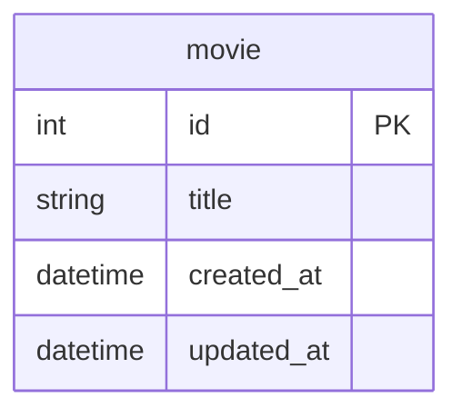

# GoのQueryContextを更新で使うケース

## 概要

- Goのdatabase/sqlパッケージでPostgreSQLとMySQLを使う場合の主な違いについて `ExecContext` `QueryContext` `QueryRowContext` を中心に整理
- 通常は、更新で`ExecContext` を使い、参照で `QueryContext` もしくは `QueryRowContext` を使う
- 更新で `QueryContext` もしくは `QueryRowContext` を使うケースについても掘り下げる

## Docker

データベースはPostgreSQLとMySQLのDockerコンテナを使用する

https://github.com/ystkg/db-examples/blob/71ee2b2fcb12ecb81da92a7ff1b9e3f29a4fd427/ex01/docker-compose.yml#L1-L19

### データベースのコンテナ起動

```shell
docker-compose up -d
```

もしくはDocker Composeのプラグイン版なら

```shell
docker compose up -d
```

### データベースのコンテナ削除

```shell
docker-compose down
```

もしくはDocker Composeのプラグイン版なら

```shell
docker compose down
```

## テーブル

- 実行時のセットアップ処理で初期化
- 1テーブル（movie）のみ
- 主キーはデータベース側で採番



## サンプルコードの実行

```shell
go run . サンプル名
```

- サンプル名は大文字小文字の区別なし

例

```shell
go run . ex01mysql01
```

- PostgreSQLのサンプルはSQLドライバにデフォルトで `pgx` を使う
- `pq` を使う場合はパラメータで指定する

 `pq` を指定する例

```shell
go run . ex01pg01 pq
```

## MySQL

### データベース接続

https://github.com/ystkg/db-examples/blob/8606dcab6480b82ed10a9e8fc70e84e417bd622e/ex01/main.go#L112-L123

### INSERT/SELECT/DELETE

- 1レコードINSERTしたあと、SELECTして、最後にDELETEする
- 更新で `ExecContext` を使い、1レコードの取得で `QueryRowContext` を使う

https://github.com/ystkg/db-examples/blob/71ee2b2fcb12ecb81da92a7ff1b9e3f29a4fd427/ex01/ex01mysql01.go#L11-L59

```shell
go run . ex01mysql01
```

```json
{"time":"2024-10-05T10:12:56.579056406+09:00","level":"INFO","msg":"SELECT","id":100,"title":"タイトルA","created_at":"2024-10-05T10:12:57+09:00","updated_at":"2024-10-05T10:12:57+09:00"}
```

- 実行するとINSERTしたレコードをSELECTした結果がログに出力される

### LastInsertId

- INSERTを実行した `ExecContext` の戻り値でデータベース側で採番されたidを取得する

https://github.com/ystkg/db-examples/blob/71ee2b2fcb12ecb81da92a7ff1b9e3f29a4fd427/ex01/ex01mysql02.go#L23-L51

```shell
go run . ex01mysql02
```

```json
{"time":"2024-10-05T10:13:19.662735029+09:00","level":"INFO","msg":"INSERT","lastInsertId":100,"rowsAffected":1}
{"time":"2024-10-05T10:13:19.664145851+09:00","level":"INFO","msg":"SELECT","id":100,"title":"タイトルA","created_at":"2024-10-05T10:13:20+09:00","updated_at":"2024-10-05T10:13:20+09:00"}
```

- 合わせて `RowsAffected()` でINSERTされたレコード数の取得

### 複数レコードのINSERT

- 複数レコードをINSERTする

https://github.com/ystkg/db-examples/blob/71ee2b2fcb12ecb81da92a7ff1b9e3f29a4fd427/ex01/ex01mysql03.go#L25-L79

```shell
go run . ex01mysql03
```

```json
{"time":"2024-10-05T10:13:39.623403726+09:00","level":"INFO","msg":"INSERT","lastInsertId":100,"rowsAffected":3}
{"time":"2024-10-05T10:13:39.624580429+09:00","level":"INFO","msg":"SELECT","id":102,"title":"タイトルC","created_at":"2024-10-05T10:13:40+09:00","updated_at":"2024-10-05T10:13:40+09:00"}
{"time":"2024-10-05T10:13:39.624624734+09:00","level":"INFO","msg":"SELECT","id":101,"title":"タイトルB","created_at":"2024-10-05T10:13:40+09:00","updated_at":"2024-10-05T10:13:40+09:00"}
{"time":"2024-10-05T10:13:39.624632558+09:00","level":"INFO","msg":"SELECT","id":100,"title":"タイトルA","created_at":"2024-10-05T10:13:40+09:00","updated_at":"2024-10-05T10:13:40+09:00"}
{"time":"2024-10-05T10:13:39.625854118+09:00","level":"INFO","msg":"DELETE","rowsAffected":3}
```

- `LastInsertId()` は最後のレコードのidではなく、最初のレコードのid
- SELECT結果のログ出力は `ORDER BY id DESC` としているのでINSERTとは逆順

## PostgreSQL

### データベース接続

#### pgx

https://github.com/ystkg/db-examples/blob/a90d5030c46fb38b704f2ed9fb2698b761823739/ex01/main.go#L15

https://github.com/ystkg/db-examples/blob/a90d5030c46fb38b704f2ed9fb2698b761823739/ex01/main.go#L70-L74

- driverNameは `pgx`
  - [sql.Openの例](https://github.com/jackc/pgx/blob/v5.7.1/stdlib/sql.go#L5)

#### pq

https://github.com/ystkg/db-examples/blob/a90d5030c46fb38b704f2ed9fb2698b761823739/ex01/main.go#L16

https://github.com/ystkg/db-examples/blob/a90d5030c46fb38b704f2ed9fb2698b761823739/ex01/main.go#L70-L74

- driverNameは `postgres`
  - [sql.Openの例](https://github.com/lib/pq/blob/v1.10.9/url.go#L14)

### INSERT/SELECT/DELETE

- PostgreSQLでは、プレースホルダに `?` ではなく `$1,$2,・・・` を使う

https://github.com/ystkg/db-examples/blob/71ee2b2fcb12ecb81da92a7ff1b9e3f29a4fd427/ex01/ex01pg01.go#L11-L59

```shell
go run . ex01pg01
```

```json
{"time":"2024-10-05T10:15:05.345788408+09:00","level":"INFO","msg":"SELECT","id":1,"title":"タイトルA","created_at":"2024-10-05T10:15:05.339399+09:00","updated_at":"2024-10-05T10:15:05.339399+09:00"}
```

### LastInsertId

- PostgreSQLでは、 `LastInsertId()` がサポートされていない
  - `pgx` と `pq` のどちらSQLドライバでもサポートされてない
- `RowsAffected()` でレコード数の取得はできる

https://github.com/ystkg/db-examples/blob/71ee2b2fcb12ecb81da92a7ff1b9e3f29a4fd427/ex01/ex01pg02.go#L23-L34

```shell
go run . ex01pg02
```

```json
{"time":"2024-10-05T10:15:21.432025599+09:00","level":"INFO","msg":"INSERT","lastInsertId":0,"errLastInsertId":"LastInsertId is not supported by this driver","rowsAffected":1,"errRowsAffected":null}
```

### RETURNING

- PostgreSQLでは、データベース側で採番されたidの取得には `RETURNING` で `QueryRowContext` を使う

https://github.com/ystkg/db-examples/blob/71ee2b2fcb12ecb81da92a7ff1b9e3f29a4fd427/ex01/ex01pg03.go#L23-L56

```shell
go run . ex01pg03
```

```json
{"time":"2024-10-05T10:15:34.658827958+09:00","level":"INFO","msg":"INSERT","insertId":1}
{"time":"2024-10-05T10:15:34.660122687+09:00","level":"INFO","msg":"SELECT","id":1,"title":"タイトルA","created_at":"2024-10-05T10:15:34.657634+09:00","updated_at":"2024-10-05T10:15:34.657634+09:00"}
```

- `Scan()` してデータベース側で採番されたidを取得

### 複数レコードのINSERT

- 複数レコードをINSERTする場合は、データベース側で採番されるidも複数になるので `QueryRowContext` ではなく `QueryContext` を使う

https://github.com/ystkg/db-examples/blob/71ee2b2fcb12ecb81da92a7ff1b9e3f29a4fd427/ex01/ex01pg04.go#L25-L65

```shell
go run . ex01pg04
```

```json
{"time":"2024-10-05T10:15:54.043336428+09:00","level":"INFO","msg":"INSERT","ids":[1,2,3]}
{"time":"2024-10-05T10:15:54.044646326+09:00","level":"INFO","msg":"DELETE","rowsAffected":3}
```

- INSERTした全てのレコードのidを取得することができる
- DELETEでの `RowsAffected()` では削除されたレコード数を取得できる

### 主キー以外

- `RETURNING` は対象はデータベース側で採番されたidだけでなく、任意のカラムを返すことが可能
- 例えば、デフォルトの値が設定されるカラムや、created_atやupdated_atにデータベース側で時刻が設定される場合でも取得できる
- 全カラム名を列挙したり、 `RETURNING *` とすれば全カラムを取得できる

https://github.com/ystkg/db-examples/blob/71ee2b2fcb12ecb81da92a7ff1b9e3f29a4fd427/ex01/ex01pg05.go#L25-L67

```shell
go run . ex01pg05
```

```json
{"time":"2024-10-05T10:16:14.921690858+09:00","level":"INFO","msg":"INSERT","id":1,"title":"タイトルA","created_at":"2024-10-05T10:16:14.920388+09:00","updated_at":"2024-10-05T10:16:14.920388+09:00"}
{"time":"2024-10-05T10:16:14.921748798+09:00","level":"INFO","msg":"INSERT","id":2,"title":"タイトルB","created_at":"2024-10-05T10:16:14.920388+09:00","updated_at":"2024-10-05T10:16:14.920388+09:00"}
{"time":"2024-10-05T10:16:14.921755862+09:00","level":"INFO","msg":"INSERT","id":3,"title":"タイトルC","created_at":"2024-10-05T10:16:14.920388+09:00","updated_at":"2024-10-05T10:16:14.920388+09:00"}
{"time":"2024-10-05T10:16:14.923161462+09:00","level":"INFO","msg":"DELETE","rowsAffected":3}
```

### INSERT以外

- `RETURNING` はINSERTだけでなく、UPDATEやDELETEでも使える
- DELETEでの例

https://github.com/ystkg/db-examples/blob/71ee2b2fcb12ecb81da92a7ff1b9e3f29a4fd427/ex01/ex01pg06.go#L25-L78

```shell
go run . ex01pg06
```

```json
{"time":"2024-10-05T10:16:30.626258721+09:00","level":"INFO","msg":"INSERT","ids":[1,2,3]}
{"time":"2024-10-05T10:16:30.627607273+09:00","level":"INFO","msg":"DELETE","id":1,"title":"タイトルA","created_at":"2024-10-05T10:16:30.625113+09:00","updated_at":"2024-10-05T10:16:30.625113+09:00"}
{"time":"2024-10-05T10:16:30.627651297+09:00","level":"INFO","msg":"DELETE","id":2,"title":"タイトルB","created_at":"2024-10-05T10:16:30.625113+09:00","updated_at":"2024-10-05T10:16:30.625113+09:00"}
{"time":"2024-10-05T10:16:30.627680052+09:00","level":"INFO","msg":"DELETE","id":3,"title":"タイトルC","created_at":"2024-10-05T10:16:30.625113+09:00","updated_at":"2024-10-05T10:16:30.625113+09:00"}
```

- REST APIにおけるDELETEメソッドでは `204（No Content）` で返す設計にすることも多いが、削除したリソースをレスポンスで返すよう要求される場面で活用できる
- 複数レコードのUPDATEを実行した際などに主キーをログに残すようなことにも活用できる

## 関連ドキュメント

<https://go.dev/doc/database/open-handle>

<https://go.dev/doc/database/change-data>

<https://go.dev/doc/database/querying>
