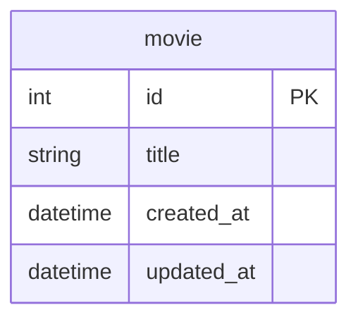

# GoのQueryContextを更新で使うケース

## 概要

- Goのdatabase/sqlパッケージでPostgreSQLとMySQLを使う場合の主な違いについて `ExecContext` `QueryContext` `QueryRowContext` を中心に整理
- 通常は、更新で`ExecContext` を使い、参照では `QueryContext` （もしくは `QueryRowContext` ）を使う
- QueryContextを更新で使うケースを少し掘り下げる

## Docker

- データベースはPostgreSQLとMySQLのDockerコンテナを使用

### データベースのコンテナ起動

```Shell
docker-compose up -d
```

もしくはDocker Composeのプラグイン版なら

```Shell
docker compose up -d
```

### データベースのコンテナ削除

```Shell
docker-compose down
```

もしくはDocker Composeのプラグイン版なら

```Shell
docker compose down
```

## テーブル

- 実行時のセットアップ処理で初期化
- 1テーブル（movie）のみ



## PostgreSQL

## MySQL

## 関連ドキュメント

<https://go.dev/doc/database/change-data>

<https://go.dev/doc/database/querying>
