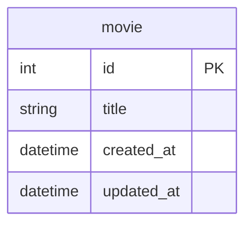

# GoのQueryContextを更新で使うケース

## 概要

- Goのdatabase/sqlパッケージでPostgreSQLとMySQLを使う場合の主な違いについて `ExecContext` `QueryContext` `QueryRowContext` を中心に整理
- 通常は、更新で`ExecContext` を使い、参照では `QueryContext` （もしくは `QueryRowContext` ）を使う
- QueryContextを更新で使うケースを少し掘り下げる

## Docker

- データベースはPostgreSQLとMySQLのDockerコンテナを使用

### データベースのコンテナ起動

```Shell
docker-compose up -d
```

もしくはDocker Composeのプラグイン版なら

```Shell
docker compose up -d
```

### データベースのコンテナ削除

```Shell
docker-compose down
```

もしくはDocker Composeのプラグイン版なら

```Shell
docker compose down
```

## テーブル

- 実行時のセットアップ処理で初期化
- 1テーブル（movie）のみ



## サンプルコードの実行

```Shell
go run . サンプル名
```

- サンプル名は大文字小文字の区別なし

例

```Shell
go run . ex01mysql01
```

- PostgreSQLのサンプルはSQLドライバにデフォルトで `pgx` を使う
- `pq` を使う場合はパラメータで指定する

例

```Shell
go run . ex01pq01 pq
```

## MySQL

### INSERT/SELECT/DELETE

- 1レコードINSERTしたあと、SELECTして、最後にDELETE
- 更新で `ExecContext` を使い、1レコードの取得で `QueryRowContext` を使う

https://github.com/ystkg/db-examples/blob/256fcb010b707c2177a01409c493e00788d2e0b4/ex01/ex01mysql01.go#L11-L59

```Shell
go run . ex01mysql01
```

```json
{"time":"2024-09-06T10:01:42.634960998+09:00","level":"INFO","msg":"SELECT","id":106,"title":"タイトルA","created_at":"2024-09-06T10:01:43+09:00","updated_at":"2024-09-06T10:01:43+09:00"}
```

実行するとINSERTしたレコードをSELECTした結果がログに出力される

### LastInsertId

INSERTを実行した `ExecContext` の戻り値にはサーバ側で採番されたidを取得

https://github.com/ystkg/db-examples/blob/256fcb010b707c2177a01409c493e00788d2e0b4/ex01/ex01mysql02.go#L23-L51

```Shell
go run . ex01mysql02
```

```json
{"time":"2024-09-06T10:02:06.951204759+09:00","level":"INFO","msg":"INSERT","lastInsertId":100,"rowsAffected":1}
{"time":"2024-09-06T10:02:06.952892057+09:00","level":"INFO","msg":"SELECT","id":100,"title":"タイトルA","created_at":"2024-09-06T10:02:07+09:00","updated_at":"2024-09-06T10:02:07+09:00"}
```

合わせて `RowsAffected()` でINSERTされたレコード数の取得

### 複数レコードのINSERT

- 複数レコードをINSERT

https://github.com/ystkg/db-examples/blob/256fcb010b707c2177a01409c493e00788d2e0b4/ex01/ex01mysql03.go#L25-L79

```Shell
go run . ex01mysql03
```

```json
{"time":"2024-09-06T10:02:33.069244776+09:00","level":"INFO","msg":"INSERT","lastInsertId":100,"rowsAffected":3}
{"time":"2024-09-06T10:02:33.070456228+09:00","level":"INFO","msg":"SELECT","id":102,"title":"タイトルC","created_at":"2024-09-06T10:02:33+09:00","updated_at":"2024-09-06T10:02:33+09:00"}
{"time":"2024-09-06T10:02:33.070501053+09:00","level":"INFO","msg":"SELECT","id":101,"title":"タイトルB","created_at":"2024-09-06T10:02:33+09:00","updated_at":"2024-09-06T10:02:33+09:00"}
{"time":"2024-09-06T10:02:33.070518015+09:00","level":"INFO","msg":"SELECT","id":100,"title":"タイトルA","created_at":"2024-09-06T10:02:33+09:00","updated_at":"2024-09-06T10:02:33+09:00"}
{"time":"2024-09-06T10:02:33.072120432+09:00","level":"INFO","msg":"DELETE","rowsAffected":3}
```

- `LastInsertId()` は最後のレコードのidではなく、最初のレコードのid
- SELECT結果のログ出力は `ORDER BY id DESC` としているのでINSERTとは逆順

## PostgreSQL

### INSERT/SELECT/DELETE

- プレースホルダには `?` ではなく `$1,$2,・・・` を使う

https://github.com/ystkg/db-examples/blob/256fcb010b707c2177a01409c493e00788d2e0b4/ex01/ex01pg01.go#L11-L59

```Shell
go run . ex01pg01
```

```json:実行結果
{"time":"2024-09-06T10:02:59.167217586+09:00","level":"INFO","msg":"SELECT","id":1,"title":"タイトルA","created_at":"2024-09-06T10:02:59.163901+09:00","updated_at":"2024-09-06T10:02:59.163901+09:00"}
```

### LastInsertId

- `LastInsertId()` がサポートされていない
  - SQLドライバは `pgx` と `pq` のどちらもサポートされてない
- `RowsAffected()` でレコード数の取得はできる

https://github.com/ystkg/db-examples/blob/256fcb010b707c2177a01409c493e00788d2e0b4/ex01/ex01pg02.go#L23-L34

```Shell
go run . ex01pg02
```

```json
{"time":"2024-09-06T10:03:23.027133682+09:00","level":"INFO","msg":"INSERT","lastInsertId":0,"errLastInsertId":"LastInsertId is not supported by this driver","rowsAffected":1,"errRowsAffected":null}
```

### RETURNING

- サーバ側で採番されたidの取得には `RETURNING` で `QueryRowContext` を使う

https://github.com/ystkg/db-examples/blob/256fcb010b707c2177a01409c493e00788d2e0b4/ex01/ex01pg03.go#L23-L56

```Shell
go run . ex01pg03
```

```json
{"time":"2024-09-06T10:03:44.995052984+09:00","level":"INFO","msg":"INSERT","insertId":1}
{"time":"2024-09-06T10:03:44.996889808+09:00","level":"INFO","msg":"SELECT","id":1,"title":"タイトルA","created_at":"2024-09-06T10:03:44.992698+09:00","updated_at":"2024-09-06T10:03:44.992698+09:00"}
```

### 複数レコードのINSERT

- 複数レコードをINSERTする場合は、採番されるidも複数になるので `QueryRowContext` ではなく `QueryContext` を使う

https://github.com/ystkg/db-examples/blob/256fcb010b707c2177a01409c493e00788d2e0b4/ex01/ex01pg04.go#L25-L65

```Shell
go run . ex01pg04
```

```json:実行結果
{"time":"2024-09-06T10:04:11.397834844+09:00","level":"INFO","msg":"INSERT","ids":[1,2,3]}
{"time":"2024-09-06T10:04:11.400161222+09:00","level":"INFO","msg":"DELETE","rowsAffected":3}
```

- DELETEでの `RowsAffected()` では削除されたレコード数を取得できる

### 主キー以外

- `RETURNING` は対象はサーバ側で採番されたidだけでなく、任意のカラムを返すことが可能
- 例えば、デフォルトの値が設定されるカラムや、created_atやupdated_atにサーバ側の時刻が設定される場合でも取得できる
- `RETURNING *` とすれば全カラムを取得できる

https://github.com/ystkg/db-examples/blob/256fcb010b707c2177a01409c493e00788d2e0b4/ex01/ex01pg05.go#L25-L67

```Shell
go run . ex01pg05
```

```json:実行結果
{"time":"2024-09-06T10:04:37.712347253+09:00","level":"INFO","msg":"INSERT","id":1,"title":"タイトルA","created_at":"2024-09-06T10:04:37.710832+09:00","updated_at":"2024-09-06T10:04:37.710832+09:00"}
{"time":"2024-09-06T10:04:37.712436243+09:00","level":"INFO","msg":"INSERT","id":2,"title":"タイトルB","created_at":"2024-09-06T10:04:37.710832+09:00","updated_at":"2024-09-06T10:04:37.710832+09:00"}
{"time":"2024-09-06T10:04:37.712444068+09:00","level":"INFO","msg":"INSERT","id":3,"title":"タイトルC","created_at":"2024-09-06T10:04:37.710832+09:00","updated_at":"2024-09-06T10:04:37.710832+09:00"}
{"time":"2024-09-06T10:04:37.713953458+09:00","level":"INFO","msg":"DELETE","rowsAffected":3}
```

### INSERT以外

- `RETURNING` はINSERTだけでなく、UPDATEやDELETEでも使える
- DELETEでの例

https://github.com/ystkg/db-examples/blob/256fcb010b707c2177a01409c493e00788d2e0b4/ex01/ex01pg06.go#L25-L78

```Shell
go run . ex01pg06
```

```json:実行結果
{"time":"2024-09-06T10:04:59.531383894+09:00","level":"INFO","msg":"INSERT","ids":[1,2,3]}
{"time":"2024-09-06T10:04:59.533002872+09:00","level":"INFO","msg":"DELETE","id":1,"title":"タイトルA","created_at":"2024-09-06T10:04:59.52977+09:00","updated_at":"2024-09-06T10:04:59.52977+09:00"}
{"time":"2024-09-06T10:04:59.533043289+09:00","level":"INFO","msg":"DELETE","id":2,"title":"タイトルB","created_at":"2024-09-06T10:04:59.52977+09:00","updated_at":"2024-09-06T10:04:59.52977+09:00"}
{"time":"2024-09-06T10:04:59.533071212+09:00","level":"INFO","msg":"DELETE","id":3,"title":"タイトルC","created_at":"2024-09-06T10:04:59.52977+09:00","updated_at":"2024-09-06T10:04:59.52977+09:00"}
```

- REST APIにおけるDELETEメソッドでは `204（No Content）` で返す設計にすることも多いが、削除したリソースをレスポンスで返すよう要求される場面で活用できる
- 複数レコードのUPDATEを実行した際などに主キーをログに残すようなことも有益

## 関連ドキュメント

<https://go.dev/doc/database/change-data>

<https://go.dev/doc/database/querying>
