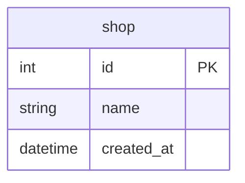

# Goのsql.DBは、いつプールに戻しているのか

## 概要

- Goの標準ライブラリの `database/sql` で中心となる sql.DB ではデフォルトでコネクションプールが使われるようになっていて明示的な操作は不要
- プールに返却されるタイミングを整理

## Docker

- データベースはPostgreSQLのDockerコンテナを使用

### データベースのコンテナ起動

```Shell
docker-compose up -d
```

もしくはDocker Composeのプラグイン版なら

```Shell
docker compose up -d
```

### データベースのコンテナ削除

```Shell
docker-compose down
```

もしくはDocker Composeのプラグイン版なら

```Shell
docker compose down
```

## テーブル

- 実行時のセットアップ処理で初期化
- 1テーブル（shop）のみ



## サンプルコードの実行

```Shell
go run . サンプル名
```

- サンプル名は大文字小文字の区別なし

例

```Shell
go run . ex0201
```

## *sql.Conn

- *sql.Conn の `Close()` でプールに返却
- トランザクションありでINSERTを連続して2回実行
- 実装の全体

https://github.com/ystkg/db-examples/blob/5fa9f3fff403198957ccabf6cb54be5820f469ff/ex02/ex0201.go#L11-L59

- コネクションプールの状態をログ出力させて確認
- 処理の流れを追いやすくするため、関心事だけに絞る

https://github.com/ystkg/db-examples/blob/5fa9f3fff403198957ccabf6cb54be5820f469ff/ex02/ex0202.go#L9-L24

確認するプールの各ステータスです。

https://github.com/golang/go/blob/go1.23.2/src/database/sql/sql.go#L1193-L1196

```Shell
go run . ex0202
```

```json
{"time":"2024-09-10T12:12:36.181796186+09:00","level":"INFO","msg":"before","Open":1,"InUse":1,"Idle":0}
{"time":"2024-09-10T12:12:36.181937016+09:00","level":"INFO","msg":"after ","Open":1,"InUse":0,"Idle":1}
```

- `conn.Close()` の前後でInUseからIdleに移っている。つまりプールに返却されている

## *sql.DB/*sql.Tx

- CommitもしくはRollbackでプールに返却される。*sql.Txに `Close()` はない

```Shell
go run . ex0203
```

```json
{"time":"2024-10-03T18:48:28.335019383+09:00","level":"INFO","msg":"before","Open":1,"InUse":1,"Idle":0}
{"time":"2024-10-03T18:48:28.336647909+09:00","level":"INFO","msg":"after ","Open":1,"InUse":0,"Idle":1}
```

```Shell
go run . ex0204
```

```json
{"time":"2024-10-03T18:48:29.981928809+09:00","level":"INFO","msg":"before","Open":1,"InUse":1,"Idle":0}
{"time":"2024-10-03T18:48:29.982618874+09:00","level":"INFO","msg":"after ","Open":1,"InUse":0,"Idle":1}
```

## *sql.Conn/*sql.Tx

- CommitもしくはRollbackでプールに返却されない。*sql.Connの `Close()` で返却
- *sql.DBでBeginTxした場合と*sql.ConnでBeginTxした場合とで異なる

```Shell
go run . ex0205
```

```json
{"time":"2024-10-03T18:52:32.601262941+09:00","level":"INFO","msg":"before","Open":1,"InUse":1,"Idle":0}
{"time":"2024-10-03T18:52:32.602614139+09:00","level":"INFO","msg":"after ","Open":1,"InUse":1,"Idle":0,"err":null}
```

- `InUse` に残ったままで返却されていない
- エラーも発生していない

## DB.ExecContext

- 実行毎にプールに返却

```Shell
go run . ex0206
```

```json
{"time":"2024-09-10T12:13:49.153025371+09:00","level":"INFO","msg":"before","Open":1,"InUse":0,"Idle":1}
{"time":"2024-09-10T12:13:49.156507279+09:00","level":"INFO","msg":"after ","Open":1,"InUse":0,"Idle":1}
```

## DB.QueryRowContext

- row.Scan()でプールに返却

```Shell
go run . ex0207
```

```json
{"time":"2024-09-10T12:14:18.114116303+09:00","level":"INFO","msg":"before","Open":1,"InUse":1,"Idle":0}
{"time":"2024-09-10T12:14:18.114284424+09:00","level":"INFO","msg":"after ","Open":1,"InUse":0,"Idle":1,"id":1,"name":"shop1"}
```

## DB.QueryContext

- `rows.Next()` が false になったタイミングでプールに返却
- 処理の流れを追いやすくするため、for文を使わずにループを展開

```Shell
go run . ex0208
```

```json
{"time":"2024-09-10T12:14:48.961659094+09:00","level":"INFO","msg":"before","Open":1,"InUse":1,"Idle":0,"id":2,"name":"shop2"}
{"time":"2024-09-10T12:14:48.961880508+09:00","level":"INFO","msg":"after ","Open":1,"InUse":0,"Idle":1}
```

- もし仮に false になるまで `rows.Next()` を呼ばなかった場合ですが、そのときは `rows.Close()` のタイミングで返却されました。

```Shell
go run . ex0209
```

```json
{"time":"2024-09-10T12:15:09.62954833+09:00","level":"INFO","msg":"before","Open":1,"InUse":1,"Idle":0,"id":1,"name":"shop1"}
{"time":"2024-09-10T12:15:09.62968931+09:00","level":"INFO","msg":"after ","Open":1,"InUse":0,"Idle":1}
```

## DB.Close

- DB.Closeはプールにあるコネクションをクローズする

```Shell
go run . ex0210
```

```json
{"time":"2024-10-03T19:09:47.607473683+09:00","level":"INFO","msg":"before","Open":5,"InUse":0,"Idle":5}
{"time":"2024-10-03T19:09:47.607883584+09:00","level":"INFO","msg":"after ","Open":0,"InUse":0,"Idle":0}
```

- クローズされるコネクションはIdleのみで、InUseはClose()でプールに戻されることなく、直接クローズされる

```Shell
go run . ex0211
```

```json
{"time":"2024-10-03T19:18:47.339110632+09:00","level":"INFO","msg":"before","Open":5,"InUse":3,"Idle":2}
{"time":"2024-10-03T19:18:47.339325672+09:00","level":"INFO","msg":"after ","Open":3,"InUse":3,"Idle":0}
{"time":"2024-10-03T19:18:47.339404192+09:00","level":"INFO","msg":"0     ","Open":2,"InUse":2,"Idle":0}
{"time":"2024-10-03T19:18:47.339476971+09:00","level":"INFO","msg":"1     ","Open":1,"InUse":1,"Idle":0}
{"time":"2024-10-03T19:18:47.339512448+09:00","level":"INFO","msg":"2     ","Open":1,"InUse":1,"Idle":0}
{"time":"2024-10-03T19:18:47.339519552+09:00","level":"INFO","msg":"3     ","Open":1,"InUse":1,"Idle":0}
{"time":"2024-10-03T19:18:47.339563796+09:00","level":"INFO","msg":"4     ","Open":0,"InUse":0,"Idle":0}
```

## 関連ドキュメント

<https://go.dev/doc/database/manage-connections>
