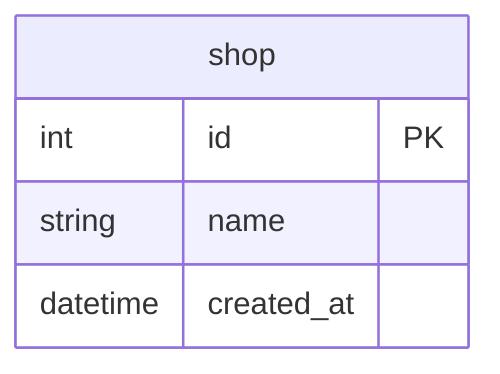

# Goのsql.DBは、いつプールに戻しているのか

## 概要

- Goの標準ライブラリの `database/sql` で中心となる sql.DB ではデフォルトでコネクションプールが使われるようになっていて明示的な操作は不要
- どのタイミングでプールに返却されているのか、パターンを整理

## Docker

- データベースはPostgreSQLのDockerコンテナを使用

### データベースのコンテナ起動

```Shell
docker-compose up -d
```

もしくはDocker Composeのプラグイン版なら

```Shell
docker compose up -d
```

### データベースのコンテナ削除

```Shell
docker-compose down
```

もしくはDocker Composeのプラグイン版なら

```Shell
docker compose down
```

## テーブル

- 実行時のセットアップ処理で初期化
- 1テーブル（shop）のみ



## PostgreSQL

## 関連ドキュメント

<https://go.dev/doc/database/manage-connections>
