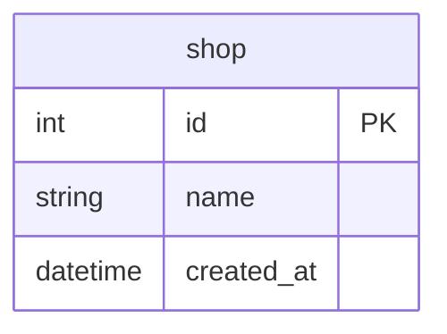

# Goのsql.DBは、いつプールに戻しているのか

## 概要

- Goの標準ライブラリの `database/sql` で中心となる sql.DB ではデフォルトでコネクションプールが使われるようになっていて明示的な操作は不要
- どのタイミングでプールに返却されているのか、パターンを整理

## Docker

- データベースはPostgreSQLのDockerコンテナを使用

### データベースのコンテナ起動

```Shell
docker-compose up -d
```

もしくはDocker Composeのプラグイン版なら

```Shell
docker compose up -d
```

### データベースのコンテナ削除

```Shell
docker-compose down
```

もしくはDocker Composeのプラグイン版なら

```Shell
docker compose down
```

## テーブル

- 実行時のセットアップ処理で初期化
- 1テーブル（shop）のみ



## サンプルコードの実行

```Shell
go run . サンプル名
```

- サンプル名は大文字小文字の区別なし

例

```Shell
go run . ex0201
```

## *sql.Conn

- *sql.Conn の `Close()` で返却されるパターン
- トランザクションありで連続してINSERTを2回実行
- 実装の全体

https://github.com/ystkg/db-examples/blob/5fa9f3fff403198957ccabf6cb54be5820f469ff/ex02/ex0201.go#L11-L59

- コネクションプールの状態をログ出力させて確認
- 処理の流れを追いやすくするため、関心事だけに絞る

https://github.com/ystkg/db-examples/blob/5fa9f3fff403198957ccabf6cb54be5820f469ff/ex02/ex0202.go#L9-L24

```Shell
go run . ex0202
```

```json
{"time":"2024-09-10T12:12:36.181796186+09:00","level":"INFO","msg":"before","Open":1,"InUse":1,"Idle":0}
{"time":"2024-09-10T12:12:36.181937016+09:00","level":"INFO","msg":"after ","Open":1,"InUse":0,"Idle":1}
```

- `conn.Close()` の前後でInUseからIdleに移っている
- つまりプールに返却されていることが確認できる

## 関連ドキュメント

<https://go.dev/doc/database/manage-connections>
