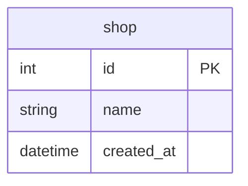

# Goのsql.DBは、いつプールに戻しているのか

## 概要

- Goの標準ライブラリの `database/sql` で中心となる sql.DB ではデフォルトでコネクションプールが使われるようになっていて明示的な操作は不要
- どのタイミングでプールに返却されているのかについてパターンを整理

## Docker

データベースはPostgreSQLのDockerコンテナを使用する

https://github.com/ystkg/db-examples/blob/09e3b30fc34ca1dfa0051c3e95ae46d10b184e40/ex02/docker-compose.yml#L2-L10

### データベースのコンテナ起動

```Shell
docker compose up -d --wait
```

- Docker Composeはプラグイン版

### データベースのコンテナ削除

```shell
docker compose down
```

## テーブル

- 実行時のセットアップ処理で初期化
- 1テーブル（shop）のみ
- 主キーはデータベース側で採番



## サンプルコードの実行

```shell
go run . サンプル名
```

- サンプル名は大文字小文字の区別なし

例

```shell
go run . ex0201
```

## *sql.Conn

- *sql.Conn の `Close()` でプールに返却されるパターン。トランザクションありでINSERTを連続して2回実行する例

https://github.com/ystkg/db-examples/blob/46035e1953a4c152ccdc3e5ec34cc0c9f5a057e4/ex02/ex0201.go#L11-L59

- 処理の流れを追いやすくするため、実装は関心事だけに絞り、ログ出力によりコネクションプールの状態を確認

https://github.com/ystkg/db-examples/blob/46035e1953a4c152ccdc3e5ec34cc0c9f5a057e4/ex02/ex0202.go#L9-L24

```shell
go run . ex0202
```

```json
{"time":"2024-10-05T10:18:16.514616341+09:00","level":"INFO","msg":"before","Open":1,"InUse":1,"Idle":0}
{"time":"2024-10-05T10:18:16.514732242+09:00","level":"INFO","msg":"after ","Open":1,"InUse":0,"Idle":1}
```

- `conn.Close()` の前後でInUseからIdleに移っている。つまりプールに返却されている
  - [プールの各ステータス](https://github.com/golang/go/blob/go1.24.1/src/database/sql/sql.go#L1201-L1204)

https://github.com/ystkg/db-examples/blob/46035e1953a4c152ccdc3e5ec34cc0c9f5a057e4/ex02/main.go#L70-L73

## \*sql.DB/*sql.Tx

- CommitもしくはRollbackでプールに返却されるパターン（*sql.Txに `Close()` はない）

### Commit

https://github.com/ystkg/db-examples/blob/46035e1953a4c152ccdc3e5ec34cc0c9f5a057e4/ex02/ex0203.go#L12-L20

```shell
go run . ex0203
```

```json
{"time":"2024-10-05T10:18:32.800364346+09:00","level":"INFO","msg":"before","Open":1,"InUse":1,"Idle":0}
{"time":"2024-10-05T10:18:32.801725492+09:00","level":"INFO","msg":"after ","Open":1,"InUse":0,"Idle":1}
```

- `tx.Commit()` でプールに返却されている

### Rollback

https://github.com/ystkg/db-examples/blob/46035e1953a4c152ccdc3e5ec34cc0c9f5a057e4/ex02/ex0204.go#L12-L18

```shell
go run . ex0204
```

```json
{"time":"2024-10-05T10:18:54.929728177+09:00","level":"INFO","msg":"before","Open":1,"InUse":1,"Idle":0}
{"time":"2024-10-05T10:18:54.930214444+09:00","level":"INFO","msg":"after ","Open":1,"InUse":0,"Idle":1}
```

- `tx.Rollback()` でプールに返却されている

## \*sql.Conn/*sql.Tx

- \*sql.DBで `BeginTx()` した場合と*sql.Connで `BeginTx()` した場合とで挙動が異なる
- \*sql.Connで `BeginTx()` した場合は `Commit()` と `Rollback()` ではプールに返却されず、*sql.Connの `Close()` するまでは返却されない

https://github.com/ystkg/db-examples/blob/46035e1953a4c152ccdc3e5ec34cc0c9f5a057e4/ex02/ex0205.go#L12-L23

```shell
go run . ex0205
```

```json
{"time":"2024-10-05T10:19:11.595791369+09:00","level":"INFO","msg":"before","Open":1,"InUse":1,"Idle":0}
{"time":"2024-10-05T10:19:11.597110634+09:00","level":"INFO","msg":"after ","Open":1,"InUse":1,"Idle":0,"err":null}
```

- InUseに残ったままで返却されていない
- エラーも発生していない

## DB.ExecContext

- 実行毎にプールに返却されるパターン

https://github.com/ystkg/db-examples/blob/46035e1953a4c152ccdc3e5ec34cc0c9f5a057e4/ex02/ex0206.go#L12-L18

```shell
go run . ex0206
```

```json
{"time":"2024-10-05T10:19:24.938171633+09:00","level":"INFO","msg":"before","Open":1,"InUse":0,"Idle":1}
{"time":"2024-10-05T10:19:24.939661816+09:00","level":"INFO","msg":"after ","Open":1,"InUse":0,"Idle":1}
```

- 前後ともInUseが0になっている

## DB.QueryRowContext

- `row.Scan()` でプールに返却されるパターン

https://github.com/ystkg/db-examples/blob/46035e1953a4c152ccdc3e5ec34cc0c9f5a057e4/ex02/ex0207.go#L12-L20

```shell
go run . ex0207
```

```json
{"time":"2024-10-05T10:26:25.223398589+09:00","level":"INFO","msg":"before","Open":1,"InUse":1,"Idle":0}
{"time":"2024-10-05T10:26:25.223483481+09:00","level":"INFO","msg":"after ","Open":1,"InUse":0,"Idle":1,"id":1,"name":"shop1"}
```

## DB.QueryContext

- `rows.Next()` が false になったタイミングでプールに返却されるパターン
  - 処理の流れを追いやすくするため、for文を使わずにループを展開

https://github.com/ystkg/db-examples/blob/46035e1953a4c152ccdc3e5ec34cc0c9f5a057e4/ex02/ex0208.go#L14-L32

```shell
go run . ex0208
```

```json
{"time":"2024-10-05T10:26:41.701379244+09:00","level":"INFO","msg":"before","Open":1,"InUse":1,"Idle":0,"id":2,"name":"shop2"}
{"time":"2024-10-05T10:26:41.701453886+09:00","level":"INFO","msg":"after ","Open":1,"InUse":0,"Idle":1}
```

- もし仮に false になるまで `rows.Next()` を呼ばなかった場合は `rows.Close()` のタイミングで返却されることになる

https://github.com/ystkg/db-examples/blob/46035e1953a4c152ccdc3e5ec34cc0c9f5a057e4/ex02/ex0209.go#L14-L26

```shell
go run . ex0209
```

```json
{"time":"2024-10-05T10:27:00.564888592+09:00","level":"INFO","msg":"before","Open":1,"InUse":1,"Idle":0,"id":1,"name":"shop1"}
{"time":"2024-10-05T10:27:00.564959969+09:00","level":"INFO","msg":"after ","Open":1,"InUse":0,"Idle":1}
```

## DB.Close

- DB.Closeはプールにあるコネクションをクローズする

https://github.com/ystkg/db-examples/blob/46035e1953a4c152ccdc3e5ec34cc0c9f5a057e4/ex02/ex0210.go#L9-L21

```shell
go run . ex0210
```

```json
{"time":"2024-10-05T10:27:19.849655477+09:00","level":"INFO","msg":"before","Open":5,"InUse":0,"Idle":5}
{"time":"2024-10-05T10:27:19.849937555+09:00","level":"INFO","msg":"after ","Open":0,"InUse":0,"Idle":0}
```

- OpenとIdleも0になっている
- ただし、InUseのコネクションはクローズされない

https://github.com/ystkg/db-examples/blob/46035e1953a4c152ccdc3e5ec34cc0c9f5a057e4/ex02/ex0211.go#L9-L35

```shell
go run . ex0211
```

```json
{"time":"2024-10-05T10:27:33.158506751+09:00","level":"INFO","msg":"before","Open":5,"InUse":3,"Idle":2}
{"time":"2024-10-05T10:27:33.158716381+09:00","level":"INFO","msg":"after ","Open":3,"InUse":3,"Idle":0}
{"time":"2024-10-05T10:27:33.158800542+09:00","level":"INFO","msg":"conn 0","Open":2,"InUse":2,"Idle":0}
{"time":"2024-10-05T10:27:33.159040339+09:00","level":"INFO","msg":"conn 1","Open":1,"InUse":1,"Idle":0}
{"time":"2024-10-05T10:27:33.159085245+09:00","level":"INFO","msg":"conn 2","Open":1,"InUse":1,"Idle":0}
{"time":"2024-10-05T10:27:33.159092198+09:00","level":"INFO","msg":"conn 3","Open":1,"InUse":1,"Idle":0}
{"time":"2024-10-05T10:27:33.159241823+09:00","level":"INFO","msg":"conn 4","Open":0,"InUse":0,"Idle":0}
```

- Idleが0になってもInUseは3のまま残っている
- クローズされるコネクションはIdleのみで、InUseは `Close()` でプールに戻されることなく、直接クローズされている

## プールの制御

デフォルトでコネクションプールが使われるようになっているが、明示的にプールに戻すタイミングを制御する用途向けとして sql.Conn が用意されいる

https://github.com/golang/go/blob/go1.24.1/src/database/sql/sql.go#L2147-L2154

https://github.com/golang/go/blob/go1.24.1/src/database/sql/sql.go#L1943-L1945

## 関連ドキュメント

<https://go.dev/doc/database/manage-connections>
