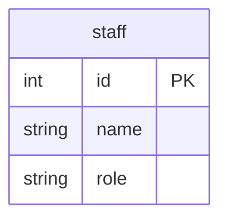

# GoのSQLインジェクション対策

## 概要

- SQLインジェクションのリスクを回避する方法として、プレースホルダ（placeholder）とプリペアドステートメント（prepared statement）を用いられている
- Goの標準ライブラリを探してみるとdatabase/sqlパッケージに `PrepareContext()` との関連性を整理
- SQLインジェクション対策のセーフティネットの位置付けとし、前段で入力に対し十分にバリデーションされていることを前提とする

## Docker

- データベースはPostgreSQLとMySQLのDockerコンテナを使用

### データベースのコンテナ起動

```Shell
docker-compose up -d
```

もしくはDocker Composeのプラグイン版なら

```Shell
docker compose up -d
```

### データベースのコンテナ削除

```Shell
docker-compose down
```

もしくはDocker Composeのプラグイン版なら

```Shell
docker compose down
```

### PostgreSQL

#### クエリーログの設定

接続オプションに `log_statement=all` を追加

#### クエリーログの参照

標準エラー（stderr）に出力される

```shell
docker logs -f pgstmt
```

### MySQL

#### クエリーログの設定

```shell
docker container exec -e MYSQL_PWD=expasswd mysqlstmt mysql stmtdb -e "set global general_log = on"
docker container exec -e MYSQL_PWD=expasswd mysqlstmt mysql stmtdb -e "set global general_log_file = '/var/lib/mysql/query.log'"
docker container exec -e MYSQL_PWD=expasswd mysqlstmt mysql stmtdb -e "set global log_timestamps = SYSTEM"
```

#### クエリーログの参照

general_log_fileに設定したファイルに出力される

```shell
docker container exec mysqlstmt tail -f /var/lib/mysql/query.log
```

## テーブル

- 実行時のセットアップ処理で初期化
- 1テーブル（staff）のみ



## サンプルコードの実行

```Shell
go run . サンプル名
```

- サンプル名は大文字小文字の区別なし

例

```Shell
go run . ex03mysql01
```

- PostgreSQLのサンプルはSQLドライバにデフォルトで `pgx` を使う
- `pq` を使う場合はパラメータで指定する

例

```Shell
go run . ex03pg01 pq
```

## PostgreSQL

### PrepareContext

- PrepareContextを使う

```Shell
go run . ex03pg01
```

```log
2024-09-12 19:34:13.280 JST [1554] LOG:  execute stmt_8b2eda7af60ccc71922fa6d55c2c84253fe4f0a503bdc7de: SELECT id, name, role FROM staff WHERE name = $1
2024-09-12 19:34:13.280 JST [1554] DETAIL:  parameters: $1 = 'Bob'
2024-09-12 19:34:13.281 JST [1554] LOG:  execute stmt_8b2eda7af60ccc71922fa6d55c2c84253fe4f0a503bdc7de: SELECT id, name, role FROM staff WHERE name = $1
2024-09-12 19:34:13.281 JST [1554] DETAIL:  parameters: $1 = 'Carol'
```

### QueryContext

- PrepareContextを使わずにQueryContextを使う

```Shell
go run . ex03pg02
```

```log
2024-09-12 19:35:14.457 JST [1560] LOG:  execute stmtcache_8b2eda7af60ccc71922fa6d55c2c84253fe4f0a503bdc7de: SELECT id, name, role FROM staff WHERE name = $1
2024-09-12 19:35:14.457 JST [1560] DETAIL:  parameters: $1 = 'Bob'
2024-09-12 19:35:14.458 JST [1560] LOG:  execute stmtcache_8b2eda7af60ccc71922fa6d55c2c84253fe4f0a503bdc7de: SELECT id, name, role FROM staff WHERE name = $1
2024-09-12 19:35:14.458 JST [1560] DETAIL:  parameters: $1 = 'Carol'
```

- PrepareContextを使わなくても、プリペアドステートメントで実行されている

## MySQL

## 関連ドキュメント

<https://go.dev/doc/database/sql-injection>
