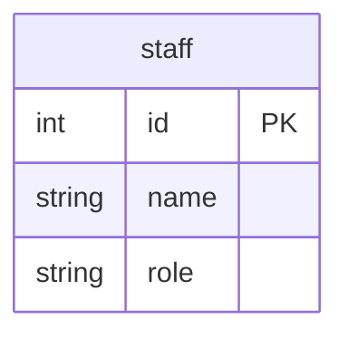

# GoのSQLインジェクション対策

## 概要

- SQLインジェクションのリスクを回避する方法として、プレースホルダ（placeholder）とプリペアドステートメント（prepared statement）を用いられている
- Goの標準ライブラリ（database/sqlパッケージ）にある `PrepareContext()` との関連性を整理
- SQLインジェクション対策のセーフティネットの位置付けとし、前段で入力に対し十分にバリデーションされていることを前提とする

## Docker

データベースはPostgreSQLとMySQLのDockerコンテナを使用する

https://github.com/ystkg/db-examples/blob/71ee2b2fcb12ecb81da92a7ff1b9e3f29a4fd427/ex03/docker-compose.yml#L1-L19

### データベースのコンテナ起動

```shell
docker-compose up -d
```

もしくはDocker Composeのプラグイン版なら

```shell
docker compose up -d
```

### データベースのコンテナ削除

```shell
docker-compose down
```

もしくはDocker Composeのプラグイン版なら

```shell
docker compose down
```

### PostgreSQL

#### クエリーログの設定

接続オプションに `log_statement=all` を追加

#### クエリーログの参照

標準エラー（stderr）に出力される

```shell
docker logs -f pgstmt
```

### MySQL

#### クエリーログの設定

```shell
docker container exec -e MYSQL_PWD=expasswd mysqlstmt mysql stmtdb -e "set global general_log = on"
docker container exec -e MYSQL_PWD=expasswd mysqlstmt mysql stmtdb -e "set global general_log_file = '/var/lib/mysql/query.log'"
docker container exec -e MYSQL_PWD=expasswd mysqlstmt mysql stmtdb -e "set global log_timestamps = SYSTEM"
```

#### クエリーログの参照

general_log_fileに設定したファイルに出力される

```shell
docker container exec mysqlstmt tail -f /var/lib/mysql/query.log
```

## テーブル

- 実行時のセットアップ処理で初期化
- 1テーブル（staff）のみ



## サンプルコードの実行

```shell
go run . サンプル名
```

- サンプル名は大文字小文字の区別なし

例

```shell
go run . ex03mysql01
```

- PostgreSQLのサンプルはSQLドライバにデフォルトで `pgx` を使う
- `pq` を使う場合はパラメータで指定する

例

```shell
go run . ex03pg01 pq
```

## PostgreSQL

### PrepareContext

- PrepareContextを使う
- クエリーログを確認する目的のため、レコードの取得処理は省略し、rowsは即 `Close()`

https://github.com/ystkg/db-examples/blob/71ee2b2fcb12ecb81da92a7ff1b9e3f29a4fd427/ex03/ex03pg01.go#L8-L41

```shell
go run . ex03pg01
```

```log
2024-09-12 19:34:13.280 JST [1554] LOG:  execute stmt_8b2eda7af60ccc71922fa6d55c2c84253fe4f0a503bdc7de: SELECT id, name, role FROM staff WHERE name = $1
2024-09-12 19:34:13.280 JST [1554] DETAIL:  parameters: $1 = 'Bob'
2024-09-12 19:34:13.281 JST [1554] LOG:  execute stmt_8b2eda7af60ccc71922fa6d55c2c84253fe4f0a503bdc7de: SELECT id, name, role FROM staff WHERE name = $1
2024-09-12 19:34:13.281 JST [1554] DETAIL:  parameters: $1 = 'Carol'
```

- プリペアドステートメントとプレースホルダでリスク回避できている

### QueryContext

- PrepareContextを使わずにQueryContextを使う

https://github.com/ystkg/db-examples/blob/71ee2b2fcb12ecb81da92a7ff1b9e3f29a4fd427/ex03/ex03pg02.go#L15-L35

```shell
go run . ex03pg02
```

```log
2024-09-12 19:35:14.457 JST [1560] LOG:  execute stmtcache_8b2eda7af60ccc71922fa6d55c2c84253fe4f0a503bdc7de: SELECT id, name, role FROM staff WHERE name = $1
2024-09-12 19:35:14.457 JST [1560] DETAIL:  parameters: $1 = 'Bob'
2024-09-12 19:35:14.458 JST [1560] LOG:  execute stmtcache_8b2eda7af60ccc71922fa6d55c2c84253fe4f0a503bdc7de: SELECT id, name, role FROM staff WHERE name = $1
2024-09-12 19:35:14.458 JST [1560] DETAIL:  parameters: $1 = 'Carol'
```

- PrepareContextを使わなくても、プリペアドステートメントとプレースホルダによりリスク回避できている

### 文字列操作

- パラメータにプレースホルダを使わず、問題のある文字列操作でSQLを組み立てる

https://github.com/ystkg/db-examples/blob/71ee2b2fcb12ecb81da92a7ff1b9e3f29a4fd427/ex03/ex03pg03.go#L16-L36

```shell
go run . ex03pg03
```

```log
2024-09-12 19:35:35.715 JST [1563] LOG:  execute stmtcache_f751ccf27404db708a88202da6a42e59745f6c76864c555f: SELECT id, name, role FROM staff WHERE name = 'Bob'
2024-09-12 19:35:35.717 JST [1563] LOG:  execute stmtcache_e04a87592a108755025dbfb325b59b4da703a4dc9a9c4da4: SELECT id, name, role FROM staff WHERE name = 'Carol'
```

- プリペアドステートメントで実行されているが、プレースホルダを使っていないため、プリペアする時点のSQLに問題があり、リスク回避できていない

### 不正なパラメータ

- 実際に不正なパラメータを与えて確認する

https://github.com/ystkg/db-examples/blob/71ee2b2fcb12ecb81da92a7ff1b9e3f29a4fd427/ex03/ex03pg04.go#L16-L25

```shell
go run . ex03pg04
```

```log
2024-09-12 19:35:58.004 JST [1566] LOG:  execute stmtcache_930bcfe0a57b90d79cab3d327afcc399189a0caf198b438f: SELECT id, name, role FROM staff WHERE name = 'Bob' OR '1' = '1'
```

- 問題のあるSQLが実行されてしまい、staffテーブルの全レコードが返されている

### プレースホルダなし

- プレースホルダを使わないままで、PrepareContextを使う

https://github.com/ystkg/db-examples/blob/71ee2b2fcb12ecb81da92a7ff1b9e3f29a4fd427/ex03/ex03pg05.go#L16-L32

```shell
go run . ex03pg05
```

```log
2024-09-12 19:36:21.648 JST [1569] LOG:  execute stmt_930bcfe0a57b90d79cab3d327afcc399189a0caf198b438f: SELECT id, name, role FROM staff WHERE name = 'Bob' OR '1' = '1'
```

- 同じように問題のあるSQLが実行されてしまうため、PrepareContextを使っているというだけでは不十分

### プレースホルダあり

- プレースホルダを使って不正なパラメータを与えて確認する

https://github.com/ystkg/db-examples/blob/71ee2b2fcb12ecb81da92a7ff1b9e3f29a4fd427/ex03/ex03pg06.go#L15-L24

```shell
go run . ex03pg06
```

```log
2024-09-12 19:36:45.670 JST [1571] LOG:  execute stmtcache_8b2eda7af60ccc71922fa6d55c2c84253fe4f0a503bdc7de: SELECT id, name, role FROM staff WHERE name = $1
2024-09-12 19:36:45.670 JST [1571] DETAIL:  parameters: $1 = 'Bob'' OR ''1'' = ''1'
```

- 期待通りリスク回避が機能し、検索結果は0レコードになる

## pq

### PrepareContext

- SQLドライバを pq に変更してPrepareContextを使う

https://github.com/ystkg/db-examples/blob/71ee2b2fcb12ecb81da92a7ff1b9e3f29a4fd427/ex03/ex03pg01.go#L8-L41

```shell
go run . ex03pg01 pq
```

```log
2024-09-12 19:37:15.018 JST [1574] LOG:  execute 1: SELECT id, name, role FROM staff WHERE name = $1
2024-09-12 19:37:15.018 JST [1574] DETAIL:  parameters: $1 = 'Bob'
2024-09-12 19:37:15.019 JST [1574] LOG:  execute 1: SELECT id, name, role FROM staff WHERE name = $1
2024-09-12 19:37:15.019 JST [1574] DETAIL:  parameters: $1 = 'Carol
```

- 出力されるログの雰囲気は少し変化しているが、プリペアドステートメントとプレースホルダによりリスク回避できている

### QueryContext

- QueryContextを使う

https://github.com/ystkg/db-examples/blob/71ee2b2fcb12ecb81da92a7ff1b9e3f29a4fd427/ex03/ex03pg02.go#L15-L35

```shell
go run . ex03pg02 pq
```

```log
2024-09-12 19:37:36.020 JST [1577] LOG:  execute <unnamed>: SELECT id, name, role FROM staff WHERE name = $1
2024-09-12 19:37:36.020 JST [1577] DETAIL:  parameters: $1 = 'Bob'
2024-09-12 19:37:36.022 JST [1577] LOG:  execute <unnamed>: SELECT id, name, role FROM staff WHERE name = $1
2024-09-12 19:37:36.022 JST [1577] DETAIL:  parameters: $1 = 'Carol'
```

- PrepareContextを使わない場合でも同様にプレースホルダがあるとプリペアドステートメントになっていてリスク回避できている

### プレースホルダなし

- プレースホルダを使わず、PrepareContextを使う

https://github.com/ystkg/db-examples/blob/71ee2b2fcb12ecb81da92a7ff1b9e3f29a4fd427/ex03/ex03pg05.go#L16-L32

```shell
go run . ex03pg05 pq
```

```log
2024-09-12 19:37:55.038 JST [1580] LOG:  statement: SELECT id, name, role FROM staff WHERE name = 'Bob'
2024-09-12 19:37:55.040 JST [1580] LOG:  statement: SELECT id, name, role FROM staff WHERE name = 'Carol'
```

- プレースホルダが１つもないとプリペアドステートメントは使われない

https://github.com/lib/pq/blob/2a217b94f5ccd3de31aec4152a541b9ff64bed05/conn.go#L900-L904

### プレースホルダあり

- プレースホルダを使って不正なパラメータを与えて確認する

https://github.com/ystkg/db-examples/blob/71ee2b2fcb12ecb81da92a7ff1b9e3f29a4fd427/ex03/ex03pg06.go#L15-L24

```shell
go run . ex03pg06 pq
```

```log
2024-09-12 19:38:12.857 JST [1582] LOG:  execute <unnamed>: SELECT id, name, role FROM staff WHERE name = $1
2024-09-12 19:38:12.857 JST [1582] DETAIL:  parameters: $1 = 'Bob'' OR ''1'' = ''1'
```

- プレースホルダを使うことでリスク回避できている

## プリペアドステートメントの名前

クエリーログに出力されているプリペアドステートメントの名前はSQLドライバ側で付けられている。<br>
（例： `stmt_8b2eda7af60ccc71922fa6d55c2c84253fe4f0a503bdc7de` ）

pgxではプレフィックス（ "stmt_" ）の後ろの部分がSQLのダイジェストになっていて、同一のSQLであれば同じ名前になる。

https://github.com/jackc/pgx/blob/672c4a3a24849b1f34857817e6ed76f6581bbe90/conn.go#L339-L340

pqでは `PrepareContext()` を使った際に番号が振られる。

https://github.com/lib/pq/blob/2a217b94f5ccd3de31aec4152a541b9ff64bed05/conn.go#L665-L668

また、pgxではデフォルトのキャッシュするモードが使われているとき"stmtcache_"で始まる名前になる。

https://github.com/jackc/pgx/blob/672c4a3a24849b1f34857817e6ed76f6581bbe90/internal/stmtcache/stmtcache.go#L13-L16

pgxでは、このモードをオプションのdefault_query_exec_modeで変更することができる。

https://github.com/jackc/pgx/blob/672c4a3a24849b1f34857817e6ed76f6581bbe90/conn.go#L194-L203

https://github.com/jackc/pgx/blob/672c4a3a24849b1f34857817e6ed76f6581bbe90/conn.go#L629-L668

## MySQL

### PrepareContext

- MySQLでPrepareContextを使う

https://github.com/ystkg/db-examples/blob/71ee2b2fcb12ecb81da92a7ff1b9e3f29a4fd427/ex03/ex03mysql01.go#L8-L41

```shell
go run . ex03mysql01
```

```log
2024-09-12T19:46:49.582390+09:00          101 Prepare   SELECT id, name, role FROM staff WHERE name = ?
2024-09-12T19:46:49.582816+09:00          101 Execute   SELECT id, name, role FROM staff WHERE name = 'Bob'
2024-09-12T19:46:49.583816+09:00          101 Execute   SELECT id, name, role FROM staff WHERE name = 'Carol'
2024-09-12T19:46:49.585165+09:00          101 Close stmt
```

- PrepareとExecuteが別々の行でログ出力されている

### QueryContext

- QueryContextを使う

https://github.com/ystkg/db-examples/blob/71ee2b2fcb12ecb81da92a7ff1b9e3f29a4fd427/ex03/ex03mysql02.go#L15-L35

```shell
go run . ex03mysql02
```

```log
2024-09-12T19:47:40.639029+09:00          105 Prepare   SELECT id, name, role FROM staff WHERE name = ?
2024-09-12T19:47:40.640158+09:00          105 Execute   SELECT id, name, role FROM staff WHERE name = 'Bob'
2024-09-12T19:47:40.647704+09:00          105 Close stmt
2024-09-12T19:47:40.648417+09:00          105 Prepare   SELECT id, name, role FROM staff WHERE name = ?
2024-09-12T19:47:40.649657+09:00          105 Execute   SELECT id, name, role FROM staff WHERE name = 'Carol'
2024-09-12T19:47:40.650875+09:00          105 Close stmt
```

- `PrepareContext()` を使わなくてもプレースホルダがあるのでプリペアドステートメントになっていてリスク回避できている
- つどCloseされている

### 文字列操作

- パラメータにプレースホルダを使わず、問題のある文字列操作でSQLを組み立てる

https://github.com/ystkg/db-examples/blob/71ee2b2fcb12ecb81da92a7ff1b9e3f29a4fd427/ex03/ex03mysql03.go#L16-L36

```shell
go run . ex03mysql03
```

```log
2024-09-12T19:48:13.614113+09:00          107 Query     SELECT id, name, role FROM staff WHERE name = 'Bob'
2024-09-12T19:48:13.615720+09:00          107 Query     SELECT id, name, role FROM staff WHERE name = 'Carol'
```

- プレースホルダがないとプリペアドステートメントが使われず、リスクのある状態

### 不正なパラメータ

- 実際に不正なパラメータを与えて確認する

https://github.com/ystkg/db-examples/blob/71ee2b2fcb12ecb81da92a7ff1b9e3f29a4fd427/ex03/ex03mysql04.go#L16-L32

```shell
go run . ex03mysql04
```

```log
2024-09-12T19:48:34.573546+09:00          109 Prepare   SELECT id, name, role FROM staff WHERE name = 'Bob' OR '1' = '1'
2024-09-12T19:48:34.574084+09:00          109 Execute   SELECT id, name, role FROM staff WHERE name = 'Bob' OR '1' = '1'
2024-09-12T19:48:34.575692+09:00          109 Close stmt
```

- 問題のあるSQLが実行され、staffテーブルの全レコードが返されている
- プリペアする時点のSQLに問題があることが判別しやすい

### プレースホルダ

- プレースホルダを使って不正なパラメータを与えて確認する

https://github.com/ystkg/db-examples/blob/71ee2b2fcb12ecb81da92a7ff1b9e3f29a4fd427/ex03/ex03mysql05.go#L15-L24

```shell
go run . ex03mysql05
```

```log
2024-09-12T19:48:52.565190+09:00          111 Prepare   SELECT id, name, role FROM staff WHERE name = ?
2024-09-12T19:48:52.566128+09:00          111 Execute   SELECT id, name, role FROM staff WHERE name = 'Bob\' OR \'1\' = \'1'
2024-09-12T19:48:52.567510+09:00          111 Close stmt
```

- プレースホルダを使うことでリスク回避できている

## 関連ドキュメント

<https://go.dev/doc/database/sql-injection>
