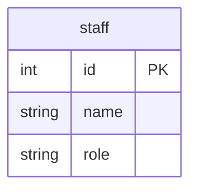

# GoのSQLインジェクション対策

## 概要

- SQLインジェクションのリスクを回避する対策として、プレースホルダ（placeholder）とプリペアドステートメント（prepared statement）が用いる方法がとられる
- Goの標準ライブラリ（database/sqlパッケージ）にある `PrepareContext()` との関連性を整理
- SQLインジェクション対策のセーフティネットの位置付けとし、前段で入力に対し十分にバリデーションされていることは前提とする

## Docker

データベースはPostgreSQLとMySQLのDockerコンテナを使用する

https://github.com/ystkg/db-examples/blob/731864acf90f1c208367831980a1df57d601021f/ex03/docker-compose.yml#L1-L19

### データベースのコンテナ起動

```Shell
docker compose up -d --wait
```

- Docker Composeはプラグイン版

### データベースのコンテナ削除

```shell
docker compose down
```

### PostgreSQL

#### クエリーログの設定

接続オプションに `log_statement=all` を追加

https://github.com/ystkg/db-examples/blob/731864acf90f1c208367831980a1df57d601021f/ex03/main.go#L77

#### クエリーログの参照

クエリーログは、標準エラー（stderr）に出力される

```shell
docker logs -f pgstmt
```

### MySQL

#### クエリーログの設定

```shell
docker container exec -e MYSQL_PWD=expasswd mysqlstmt mysql stmtdb -e "set global general_log = on"
docker container exec -e MYSQL_PWD=expasswd mysqlstmt mysql stmtdb -e "set global general_log_file = '/var/lib/mysql/query.log'"
docker container exec -e MYSQL_PWD=expasswd mysqlstmt mysql stmtdb -e "set global log_timestamps = SYSTEM"
```

#### クエリーログの参照

クエリーログは、general_log_fileに設定したファイルに出力される

```shell
docker container exec mysqlstmt tail -f /var/lib/mysql/query.log
```

## テーブル

- 実行時のセットアップ処理で初期化
- 1テーブル（staff）のみ



- PostgreSQLとMySQLともに初期データを入れておく

https://github.com/ystkg/db-examples/blob/731864acf90f1c208367831980a1df57d601021f/ex03/table/pg.dml#L1-L4

https://github.com/ystkg/db-examples/blob/731864acf90f1c208367831980a1df57d601021f/ex03/table/mysql.dml#L1-L4

## サンプルコードの実行

```shell
go run . サンプル名
```

- サンプル名は大文字小文字の区別なし

例

```shell
go run . ex03mysql01
```

- PostgreSQLのサンプルはSQLドライバにデフォルトで `pgx` を使う
- `pq` を使う場合はパラメータで指定する

`pq` を指定する例

```shell
go run . ex03pg01 pq
```

## データベース接続

### PostgreSQL(pgx)

https://github.com/ystkg/db-examples/blob/731864acf90f1c208367831980a1df57d601021f/ex03/main.go#L15

https://github.com/ystkg/db-examples/blob/731864acf90f1c208367831980a1df57d601021f/ex03/main.go#L76-L80

- driverNameは `pgx`
  - [sql.Openの例](https://github.com/jackc/pgx/blob/v5.7.1/stdlib/sql.go#L5)

### PostgreSQL(pq)

https://github.com/ystkg/db-examples/blob/731864acf90f1c208367831980a1df57d601021f/ex03/main.go#L16

https://github.com/ystkg/db-examples/blob/731864acf90f1c208367831980a1df57d601021f/ex03/main.go#L76-L80

- driverNameは `postgres`
  - [sql.Openの例](https://github.com/lib/pq/blob/v1.10.9/url.go#L14)

### MySQL

https://github.com/ystkg/db-examples/blob/731864acf90f1c208367831980a1df57d601021f/ex03/main.go#L118-L127

## PostgreSQL

### PrepareContext

- PrepareContextを使ったときのデータベース側のクエリーログを確認
- クエリーログの確認が目的のため、レコードの取得処理は省略し、rowsは即 `Close()`

https://github.com/ystkg/db-examples/blob/731864acf90f1c208367831980a1df57d601021f/ex03/ex03pg01.go#L8-L41

```shell
go run . ex03pg01
```

```log
2024-10-05 10:29:40.076 JST [67] LOG:  execute stmt_8b2eda7af60ccc71922fa6d55c2c84253fe4f0a503bdc7de: SELECT id, name, role FROM staff WHERE name = $1
2024-10-05 10:29:40.076 JST [67] DETAIL:  Parameters: $1 = 'Bob'
2024-10-05 10:29:40.076 JST [67] LOG:  execute stmt_8b2eda7af60ccc71922fa6d55c2c84253fe4f0a503bdc7de: SELECT id, name, role FROM staff WHERE name = $1
2024-10-05 10:29:40.076 JST [67] DETAIL:  Parameters: $1 = 'Carol'
```

- プリペアドステートメントが使われプレースホルダでリスク回避できている

### QueryContext

- PrepareContextを使わずにQueryContextを使ったときのデータベース側のクエリーログを確認

https://github.com/ystkg/db-examples/blob/731864acf90f1c208367831980a1df57d601021f/ex03/ex03pg02.go#L15-L35

```shell
go run . ex03pg02
```

```log
2024-10-05 10:30:15.241 JST [69] LOG:  execute stmtcache_8b2eda7af60ccc71922fa6d55c2c84253fe4f0a503bdc7de: SELECT id, name, role FROM staff WHERE name = $1
2024-10-05 10:30:15.241 JST [69] DETAIL:  Parameters: $1 = 'Bob'
2024-10-05 10:30:15.241 JST [69] LOG:  execute stmtcache_8b2eda7af60ccc71922fa6d55c2c84253fe4f0a503bdc7de: SELECT id, name, role FROM staff WHERE name = $1
2024-10-05 10:30:15.241 JST [69] DETAIL:  Parameters: $1 = 'Carol'
```

- PrepareContextを使わなくても、プリペアドステートメントが使われプレースホルダによりリスク回避できている
- PrepareContextを使うことが必須条件ではない

### 文字列操作

- パラメータにプレースホルダを使わず、問題のある文字列操作でSQLを組み立ててしまったときのデータベース側のクエリーログを確認

https://github.com/ystkg/db-examples/blob/731864acf90f1c208367831980a1df57d601021f/ex03/ex03pg03.go#L18-L38

- 望ましくない実装のため実行する際は注意喚起の目的で `deprecated` タグの指定が必要

```shell
go run -tags deprecated . ex03pg03
```

```log
2024-10-05 10:30:38.361 JST [71] LOG:  execute stmtcache_f751ccf27404db708a88202da6a42e59745f6c76864c555f: SELECT id, name, role FROM staff WHERE name = 'Bob'
2024-10-05 10:30:38.363 JST [71] LOG:  execute stmtcache_e04a87592a108755025dbfb325b59b4da703a4dc9a9c4da4: SELECT id, name, role FROM staff WHERE name = 'Carol'
```

- プリペアドステートメントで実行されているが、プレースホルダを使っていないため、プリペアする時点のSQLに問題があり、脆弱な状態になっている

### 不正なパラメータ

- 実際に不正なパラメータを与えて確認

https://github.com/ystkg/db-examples/blob/731864acf90f1c208367831980a1df57d601021f/ex03/ex03pg04.go#L18-L27

- 望ましくない実装のため実行する際は注意喚起の目的で `deprecated` タグの指定が必要

```shell
go run -tags deprecated . ex03pg04
```

```log
2024-10-05 10:30:55.931 JST [72] LOG:  execute stmtcache_930bcfe0a57b90d79cab3d327afcc399189a0caf198b438f: SELECT id, name, role FROM staff WHERE name = 'Bob' OR '1' = '1'
```

- 問題のあるSQLが実行されてしまい、staffテーブルの全レコードが返される

### プレースホルダなし

- プレースホルダを使わないままで、PrepareContextを使ったときのデータベース側のクエリーログを確認

https://github.com/ystkg/db-examples/blob/731864acf90f1c208367831980a1df57d601021f/ex03/ex03pg05.go#L18-L34

- 望ましくない実装のため実行する際は注意喚起の目的で `deprecated` タグの指定が必要

```shell
go run -tags deprecated . ex03pg05
```

```log
2024-10-05 10:31:13.800 JST [74] LOG:  execute stmt_930bcfe0a57b90d79cab3d327afcc399189a0caf198b438f: SELECT id, name, role FROM staff WHERE name = 'Bob' OR '1' = '1'
```

- 同じように問題のあるSQLが実行されてしまうため、PrepareContextを使うだけでは不十分

### プレースホルダあり

- プレースホルダを使って不正なパラメータを与えて確認

https://github.com/ystkg/db-examples/blob/731864acf90f1c208367831980a1df57d601021f/ex03/ex03pg06.go#L15-L24

```shell
go run . ex03pg06
```

```log
2024-10-05 10:31:33.294 JST [75] LOG:  execute stmtcache_8b2eda7af60ccc71922fa6d55c2c84253fe4f0a503bdc7de: SELECT id, name, role FROM staff WHERE name = $1
2024-10-05 10:31:33.294 JST [75] DETAIL:  Parameters: $1 = 'Bob'' OR ''1'' = ''1'
```

- 期待通りリスク回避が機能し、検索結果は0レコードになる

## pq

### PrepareContext

- SQLドライバを pq にしてPrepareContextを使ったときのデータベース側のクエリーログを確認

https://github.com/ystkg/db-examples/blob/731864acf90f1c208367831980a1df57d601021f/ex03/ex03pg01.go#L8-L41

```shell
go run . ex03pg01 pq
```

```log
2024-10-05 10:31:47.753 JST [77] LOG:  execute 1: SELECT id, name, role FROM staff WHERE name = $1
2024-10-05 10:31:47.753 JST [77] DETAIL:  Parameters: $1 = 'Bob'
2024-10-05 10:31:47.754 JST [77] LOG:  execute 1: SELECT id, name, role FROM staff WHERE name = $1
2024-10-05 10:31:47.754 JST [77] DETAIL:  Parameters: $1 = 'Carol'
```

- 出力されるログの雰囲気は少し変化しているが、プリペアドステートメントが使われプレースホルダによりリスク回避できている

### QueryContext

- SQLドライバを pq にしてQueryContextを使ったときのデータベース側のクエリーログを確認

https://github.com/ystkg/db-examples/blob/731864acf90f1c208367831980a1df57d601021f/ex03/ex03pg02.go#L15-L35

```shell
go run . ex03pg02 pq
```

```log
2024-10-05 10:32:03.285 JST [78] LOG:  execute <unnamed>: SELECT id, name, role FROM staff WHERE name = $1
2024-10-05 10:32:03.285 JST [78] DETAIL:  Parameters: $1 = 'Bob'
2024-10-05 10:32:03.286 JST [78] LOG:  execute <unnamed>: SELECT id, name, role FROM staff WHERE name = $1
2024-10-05 10:32:03.286 JST [78] DETAIL:  Parameters: $1 = 'Carol'
```

- PrepareContextを使わない場合でも同様にプレースホルダがあるとプリペアドステートメントが使われリスク回避できている

### 文字列操作

- SQLドライバを pq にしてパラメータにプレースホルダを使わず、問題のある文字列操作でSQLを組み立ててしまったときのデータベース側のクエリーログを確認

https://github.com/ystkg/db-examples/blob/731864acf90f1c208367831980a1df57d601021f/ex03/ex03pg03.go#L18-L38

- 望ましくない実装のため実行する際は注意喚起の目的で `deprecated` タグの指定が必要

```shell
go run -tags deprecated . ex03pg03 pq
```

```log
2024-10-05 10:32:20.364 JST [80] LOG:  statement: SELECT id, name, role FROM staff WHERE name = 'Bob'
2024-10-05 10:32:20.365 JST [80] LOG:  statement: SELECT id, name, role FROM staff WHERE name = 'Carol'
```

- プレースホルダが１つもないとプリペアドステートメントは使われない
- 脆弱な状態になっている

https://github.com/lib/pq/blob/v1.10.9/conn.go#L900-L904

### プレースホルダあり

- SQLドライバを pq にしてプレースホルダを使って不正なパラメータを与えて確認

https://github.com/ystkg/db-examples/blob/731864acf90f1c208367831980a1df57d601021f/ex03/ex03pg06.go#L15-L24

```shell
go run . ex03pg06 pq
```

```log
2024-10-05 10:32:35.364 JST [82] LOG:  execute <unnamed>: SELECT id, name, role FROM staff WHERE name = $1
2024-10-05 10:32:35.364 JST [82] DETAIL:  Parameters: $1 = 'Bob'' OR ''1'' = ''1'
```

- プレースホルダを使うことでリスク回避できている

## プリペアドステートメントの名前

クエリーログに出力されているプリペアドステートメントの名前はSQLドライバ側で付けられている。<br>
（例： `stmt_8b2eda7af60ccc71922fa6d55c2c84253fe4f0a503bdc7de` ）

- pgxではプレフィックス（ "stmt_" ）の後ろの部分がSQLのダイジェストになっていて、同一のSQLであれば同じ名前になる
  - https://github.com/jackc/pgx/blob/v5.7.1/conn.go#L339-L340
- pqでは `PrepareContext()` を使った際に番号が振られる
  - https://github.com/lib/pq/blob/v1.10.9/conn.go#L665-L668
- pgxではデフォルトのキャッシュするモードが使われているとき"stmtcache_"で始まる名前になる
  - https://github.com/jackc/pgx/blob/v5.7.1/internal/stmtcache/stmtcache.go#L13-L16
- pgxでは、このモードをオプションのdefault_query_exec_modeで変更することができる
  - https://github.com/jackc/pgx/blob/v5.7.1/conn.go#L194-L203
  - https://github.com/jackc/pgx/blob/v5.7.1/conn.go#L629-L668

## MySQL

### PrepareContext

- MySQLでPrepareContextを使ったときのデータベース側のクエリーログを確認

https://github.com/ystkg/db-examples/blob/731864acf90f1c208367831980a1df57d601021f/ex03/ex03mysql01.go#L8-L41

```shell
go run . ex03mysql01
```

```log
2024-10-05T10:33:32.990441+09:00           11 Prepare   SELECT id, name, role FROM staff WHERE name = ?
2024-10-05T10:33:32.990772+09:00           11 Execute   SELECT id, name, role FROM staff WHERE name = 'Bob'
2024-10-05T10:33:32.991512+09:00           11 Execute   SELECT id, name, role FROM staff WHERE name = 'Carol'
2024-10-05T10:33:32.992284+09:00           11 Close stmt
```

- PrepareとExecuteが別々の行でログ出力されている

### QueryContext

- MySQLでQueryContextを使ったときのデータベース側のクエリーログを確認

https://github.com/ystkg/db-examples/blob/731864acf90f1c208367831980a1df57d601021f/ex03/ex03mysql02.go#L15-L35

```shell
go run . ex03mysql02
```

```log
2024-10-05T10:33:57.293483+09:00           12 Prepare   SELECT id, name, role FROM staff WHERE name = ?
2024-10-05T10:33:57.293938+09:00           12 Execute   SELECT id, name, role FROM staff WHERE name = 'Bob'
2024-10-05T10:33:57.295132+09:00           12 Close stmt
2024-10-05T10:33:57.295459+09:00           12 Prepare   SELECT id, name, role FROM staff WHERE name = ?
2024-10-05T10:33:57.295885+09:00           12 Execute   SELECT id, name, role FROM staff WHERE name = 'Carol'
2024-10-05T10:33:57.296759+09:00           12 Close stmt
```

- PrepareContextを使わなくてもプレースホルダがあるのでプリペアドステートメントになっていてリスク回避できている
- プリペアドステートメントは、つどCloseされている

### 文字列操作

- MySQLでパラメータにプレースホルダを使わず、問題のある文字列操作でSQLを組み立ててしまったときのデータベース側のクエリーログを確認

https://github.com/ystkg/db-examples/blob/731864acf90f1c208367831980a1df57d601021f/ex03/ex03mysql03.go#L18-L38

- 望ましくない実装のため実行する際は注意喚起の目的で `deprecated` タグの指定が必要

```shell
go run -tags deprecated . ex03mysql03
```

```log
2024-10-05T10:34:13.455236+09:00           13 Query     SELECT id, name, role FROM staff WHERE name = 'Bob'
2024-10-05T10:34:13.455986+09:00           13 Query     SELECT id, name, role FROM staff WHERE name = 'Carol'
```

- プレースホルダがないとプリペアドステートメントが使われず、リスクのある状態

### 不正なパラメータ

- 実際に不正なパラメータを与えて確認

https://github.com/ystkg/db-examples/blob/731864acf90f1c208367831980a1df57d601021f/ex03/ex03mysql04.go#L18-L34

- 望ましくない実装のため実行する際は注意喚起の目的で `deprecated` タグの指定が必要

```shell
go run -tags deprecated . ex03mysql04
```

```log
2024-10-05T10:34:32.349430+09:00           14 Prepare   SELECT id, name, role FROM staff WHERE name = 'Bob' OR '1' = '1'
2024-10-05T10:34:32.349728+09:00           14 Execute   SELECT id, name, role FROM staff WHERE name = 'Bob' OR '1' = '1'
2024-10-05T10:34:32.350425+09:00           14 Close stmt
```

- 問題のあるSQLが実行され、staffテーブルの全レコードが返される
- プリペアする時点のSQLに問題があることが判別しやすい

### プレースホルダ

- プレースホルダを使って不正なパラメータを与えて確認

https://github.com/ystkg/db-examples/blob/731864acf90f1c208367831980a1df57d601021f/ex03/ex03mysql05.go#L15-L24

```shell
go run . ex03mysql05
```

```log
2024-10-05T10:34:49.522057+09:00           15 Prepare   SELECT id, name, role FROM staff WHERE name = ?
2024-10-05T10:34:49.522383+09:00           15 Execute   SELECT id, name, role FROM staff WHERE name = 'Bob\' OR \'1\' = \'1'
2024-10-05T10:34:49.523041+09:00           15 Close stmt
```

- プレースホルダを使うことでリスク回避できている

## 関連ドキュメント

<https://go.dev/doc/database/sql-injection>
