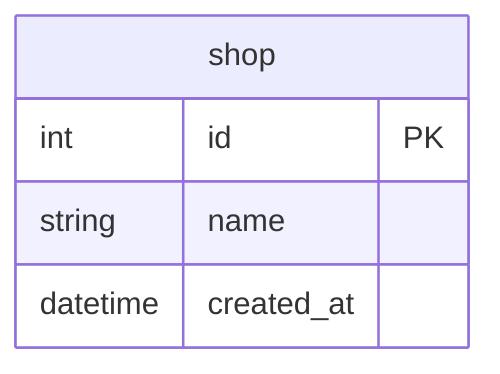

# Goで2相コミットにチャレンジ

## 概要

- Goで1相コミットと2相コミットを実装する方法を調査
- PostgreSQLとMySQLを対比させながら整理

## Docker

- データベースはPostgreSQLとMySQLのDockerコンテナを使用
- PostgreSQLとMySQLとも起動オプションでクエリーログを有効化
- PostgreSQLは `max_prepared_transactions` を 1 にして2相コミットを有効化
  - `max_prepared_transactions` は同時にプリペアド状態にできるトランザクションの最大数
  - MySQLはデフォルトで有効

### データベースのコンテナ起動

```Shell
docker-compose up -d
```

もしくはDocker Composeのプラグイン版なら

```Shell
docker compose up -d
```

### データベースのコンテナ削除

```Shell
docker-compose down
```

もしくはDocker Composeのプラグイン版なら

```Shell
docker compose down
```

### PostgreSQL

#### クエリーログの参照

標準エラー（stderr）に出力される

```shell
docker logs -f pgstmt
```

#### psqlによる接続

```shell
docker container exec -it pg2pc psql -U postgres
```

### MySQL

#### クエリーログの参照

起動オプションでgeneral_log_fileに設定したファイルに出力される

```shell
docker container exec pg2pc tail -f /var/lib/mysql/query.log
```

#### MySQLモニタによる接続

```shell
docker container exec -it -e MYSQL_PWD=expasswd mysql2pc mysql xadb
```

## テーブル

- 実行時のセットアップ処理で初期化
- 1テーブル（shop）のみ



## サンプルコードの実行

```Shell
go run . サンプル名
```

- サンプル名は大文字小文字の区別なし

例

```Shell
go run . ex04tx01
```

## 1相コミット

## ExecContext

## コマンドライン

### PostgreSQL

### MySQL

## 2相コミット

## 分離

### PostgreSQL

```shellsession
postgres=# commit prepared 'shop4th2pc';
```

### MySQL

```shellsession
mysql> XA COMMIT 'shop4th2pc';
```

## 関連ドキュメント

### PostgreSQL

<https://www.postgresql.jp/docs/16/sql-prepare-transaction.html>

<https://www.postgresql.jp/docs/16/sql-commit-prepared.html>

<https://www.postgresql.jp/docs/16/sql-rollback-prepared.html>

### MySQL

<https://dev.mysql.com/doc/refman/8.0/ja/xa.html>

<https://dev.mysql.com/doc/refman/8.0/ja/xa-statements.html>

<https://dev.mysql.com/doc/refman/8.0/ja/xa-states.html>
