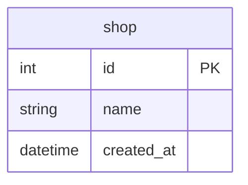

# Goで2相コミットにチャレンジ

## 概要

- Goで1相コミットと2相コミットを実装する方法を調査
- PostgreSQLとMySQLを対比させながら整理

## Docker

データベースはPostgreSQLとMySQLのDockerコンテナを使用する

https://github.com/ystkg/db-examples/blob/71ee2b2fcb12ecb81da92a7ff1b9e3f29a4fd427/ex04/docker-compose.yml#L1-L21

- PostgreSQLで2相コミットを有効化するために `max_prepared_transactions` を 1 にする
  - `max_prepared_transactions` は同時にプリペアド状態にできるトランザクションの最大数
  - 最小の 1 にしておく
  - 起動後の変更不可
- MySQLはデフォルトで2相コミット（分散トランザクション）が有効になっている
- PostgreSQLとMySQLとも起動オプションでクエリーログを有効化する
  - 起動後に変更可
  - MySQLは、この設定の影響でコンテナ起動時に接続の受付を開始するタイミングが通常よりも少し遅くなる

### データベースのコンテナ起動

```shell
docker-compose up -d
```

もしくはDocker Composeのプラグイン版なら

```shell
docker compose up -d
```

### データベースのコンテナ削除

```shell
docker-compose down
```

もしくはDocker Composeのプラグイン版なら

```shell
docker compose down
```

### PostgreSQL

#### クエリーログの参照

クエリーログは、標準エラー（stderr）に出力される

```shell
docker logs -f pg2pc
```

#### psqlによる接続

```shell
docker container exec -it pg2pc psql -U postgres
```

#### プリペアドトランザクションの確認

```shell
docker container exec -t pg2pc psql -U postgres -c 'SELECT * FROM pg_prepared_xacts'
```

### MySQL

#### クエリーログの参照

クエリーログは、general_log_fileに設定したファイルに出力される

```shell
docker container exec mysql2pc tail -f /var/lib/mysql/query.log
```

#### MySQLモニタによる接続

```shell
docker container exec -it -e MYSQL_PWD=expasswd mysql2pc mysql xadb
```

#### PREPARED 状態にある XA トランザクションの確認

```shell
docker container exec -t -e MYSQL_PWD=expasswd mysql2pc mysql xadb -e 'XA RECOVER'
```

## テーブル

- 実行時のセットアップ処理で初期化
- 1テーブル（shop）のみ
- 主キーはデータベース側で採番
- 時刻（created_at）はデータベース側で設定



- MySQLにだけ初期データを入れておく

https://github.com/ystkg/db-examples/blob/71ee2b2fcb12ecb81da92a7ff1b9e3f29a4fd427/ex04/table/mysql.dml#L1-L5

## サンプルコードの実行

```shell
go run . サンプル名
```

- サンプル名は大文字小文字の区別なし

例

```shell
go run . ex04tx01
```

## 1相コミット

### BeginTx

- 標準ライブラリに用意されているBeginTxとCommitを使う
- PostgreSQLに1レコードINSERTして、MySQLから1レコードDELETEする
  - データベース間でデータを移動させるイメージ

https://github.com/ystkg/db-examples/blob/71ee2b2fcb12ecb81da92a7ff1b9e3f29a4fd427/ex04/ex04tx01.go#L10-L92

```shell
go run . ex04tx01
```

```json
{"time":"2024-10-05T10:45:26.461878044+09:00","level":"INFO","msg":"INSERT","RowsAffected":1}
{"time":"2024-10-05T10:45:26.464105017+09:00","level":"INFO","msg":"DELETE","RowsAffected":1}

```

- データベース側のクエリーログによりPostgreSQLでは `begin` と `commit` が送信されていることが確認できる
  - SQLドライバ依存
    - [pgx](https://github.com/jackc/pgx/blob/v5.7.1/tx.go#L57)
    - [pq](https://github.com/lib/pq/blob/v1.10.9/conn.go#L583)

```log
2024-10-05 10:45:26.459 JST [91] LOG:  statement: begin
2024-10-05 10:45:26.461 JST [91] LOG:  execute stmtcache_b5197bb703d4895f640c001d049e70c77cbe7dfe8baf65fb: INSERT INTO shop (name) VALUES ($1)
2024-10-05 10:45:26.461 JST [91] DETAIL:  Parameters: $1 = 'shop1st'
2024-10-05 10:45:26.464 JST [91] LOG:  statement: commit
```

- データベース側のクエリーログによりMySQLでは `START TRANSACTION` と `COMMIT` が送信されていることが確認できる
  - SQLドライバ依存
    - [Go-MySQL-Driver](https://github.com/go-sql-driver/mysql/blob/v1.8.1/connection.go#L124)

```log
2024-10-05T10:45:26.459579+09:00            9 Query     START TRANSACTION
2024-10-05T10:45:26.462603+09:00            9 Prepare   DELETE FROM shop WHERE NAME = ?
2024-10-05T10:45:26.463305+09:00            9 Execute   DELETE FROM shop WHERE NAME = 'shop1st'
2024-10-05T10:45:26.464335+09:00            9 Close stmt
2024-10-05T10:45:26.466995+09:00            9 Query     COMMIT
```

### ExecContext

- BeginTxとCommitは使わずExecContextを使ってトランザクションを制御する
- 送信するトランザクションのコマンドは、PostgreSQLは小文字表記にし、MySQLは大文字表記にする

https://github.com/ystkg/db-examples/blob/71ee2b2fcb12ecb81da92a7ff1b9e3f29a4fd427/ex04/ex04tx02.go#L32-L96

```shell
go run . ex04tx02
```

```json
{"time":"2024-10-05T10:46:23.139315578+09:00","level":"INFO","msg":"INSERT","RowsAffected":1}
{"time":"2024-10-05T10:46:23.141185775+09:00","level":"INFO","msg":"DELETE","RowsAffected":1}

```

- データベース側のクエリーログによりPostgreSQLはExecContextを使っても同じようにトランザクション制御できることが確認できる

```log
2024-10-05 10:46:23.133 JST [94] LOG:  statement: begin
2024-10-05 10:46:23.138 JST [94] LOG:  execute stmtcache_b5197bb703d4895f640c001d049e70c77cbe7dfe8baf65fb: INSERT INTO shop (name) VALUES ($1)
2024-10-05 10:46:23.138 JST [94] DETAIL:  Parameters: $1 = 'shop2nd'
2024-10-05 10:46:23.141 JST [94] LOG:  statement: commit
```

- データベース側のクエリーログによりMySQLもExecContextを使って同じようにトランザクション制御できることが確認できる

```log
2024-10-05T10:46:23.134741+09:00           10 Query     START TRANSACTION
2024-10-05T10:46:23.139865+09:00           10 Prepare   DELETE FROM shop WHERE NAME = ?
2024-10-05T10:46:23.140321+09:00           10 Execute   DELETE FROM shop WHERE NAME = 'shop2nd'
2024-10-05T10:46:23.141383+09:00           10 Close stmt
2024-10-05T10:46:23.143516+09:00           10 Query     COMMIT
```

## 対話型

### PostgreSQL

psqlによる接続でトランザクションのコマンドを確認する

#### 1相コミット

```shell
postgres=# begin;
BEGIN
postgres=*# INSERT INTO shop (name) VALUES ('shopclitx');
INSERT 0 1
postgres=*# commit;
COMMIT
```

- 大文字小文字の区別なし（ケース・インセンシティブ）
- ロールバックは`rollback`

#### 2相コミット

- `begin` は1相コミットと同じで、 `commit` が `prepare transaction` と `commit prepared` の2段階になる
  - begin
  - prepare transaction *transaction_id*
  - commit prepared *transaction_id*
- *transaction_id* はトランザクション識別子で任意の文字列リテラル

```shell
postgres=# begin;
BEGIN
postgres=*# INSERT INTO shop (name) VALUES ('shopclixa');
INSERT 0 1
postgres=*# prepare transaction 'cli';
PREPARE TRANSACTION
postgres=# commit prepared 'cli';
COMMIT PREPARED
```

- ロールバックは`rollback prepared 'cli'`

### MySQL

MySQLモニタによる接続でトランザクションのコマンドを確認する

#### 1相コミット

```shell
mysql> START TRANSACTION;
Query OK, 0 rows affected (0.00 sec)

mysql> INSERT INTO shop (name) VALUES ('shopclitx');
Query OK, 1 row affected (0.00 sec)

mysql> COMMIT;
Query OK, 0 rows affected (0.01 sec)
```

- 大文字小文字の区別なし（ケース・インセンシティブ）
- `START TRANSACTION` は `BEGIN` でも同じ
- ロールバックは`ROLLBACK`

#### 2相コミット

- 1相コミットとは別コマンドになる。また `XA PREPARE` の前に `XA END` でトランザクションをACTIVE状態からIDLE状態にしておく必要がある
  - XA BEGIN *xid*
  - XA END *xid*
  - XA PREPARE *xid*
  - XA COMMIT *xid*
- *xid* はXAトランザクション識別子で、クライアントによって指定することもできる
  - 例では64バイト以下の文字列リテラルにしておく

```shell
mysql> XA BEGIN 'cli';
Query OK, 0 rows affected (0.00 sec)

mysql> INSERT INTO shop (name) VALUES ('shopclixa');
Query OK, 1 row affected (0.00 sec)

mysql> XA END 'cli';
Query OK, 0 rows affected (0.00 sec)

mysql> XA PREPARE 'cli';
Query OK, 0 rows affected (0.01 sec)

mysql> XA COMMIT 'cli';
Query OK, 0 rows affected (0.00 sec)
```

- ロールバックは`XA ROLLBACK 'cli'`

## 2相コミット

### 一括

- ExecContextを使って2相コミットを制御する
  - トランザクション識別子はPostgreSQL（ *transaction_id* ）とMySQL（ *xid* ）で別々にもできるが、例では同じ識別子にしておく

https://github.com/ystkg/db-examples/blob/71ee2b2fcb12ecb81da92a7ff1b9e3f29a4fd427/ex04/ex04xa01.go#L37-L149

```shell
go run . ex04xa01
```

```json
{"time":"2024-10-05T10:52:07.577642221+09:00","level":"INFO","msg":"INSERT","RowsAffected":1}
{"time":"2024-10-05T10:52:07.580293037+09:00","level":"INFO","msg":"DELETE","RowsAffected":1}
```

```log
2024-10-05 10:52:07.575 JST [114] LOG:  statement: begin
2024-10-05 10:52:07.576 JST [114] LOG:  execute stmtcache_b5197bb703d4895f640c001d049e70c77cbe7dfe8baf65fb: INSERT INTO shop (name) VALUES ($1)
2024-10-05 10:52:07.576 JST [114] DETAIL:  Parameters: $1 = 'shop3rd'
2024-10-05 10:52:07.580 JST [114] LOG:  statement: prepare transaction 'shop3rd2pc'
2024-10-05 10:52:07.587 JST [114] LOG:  statement: commit prepared 'shop3rd2pc'
```

```log
2024-10-05T10:52:07.575527+09:00           12 Query     XA BEGIN 'shop3rd2pc'
2024-10-05T10:52:07.578378+09:00           12 Prepare   DELETE FROM shop WHERE NAME = ?
2024-10-05T10:52:07.579065+09:00           12 Execute   DELETE FROM shop WHERE NAME = 'shop3rd'
2024-10-05T10:52:07.580479+09:00           12 Close stmt
2024-10-05T10:52:07.582945+09:00           12 Query     XA END 'shop3rd2pc'
2024-10-05T10:52:07.583552+09:00           12 Query     XA PREPARE 'shop3rd2pc'
2024-10-05T10:52:07.589633+09:00           12 Query     XA COMMIT 'shop3rd2pc'
```

### 分離

- PREPAREの実行（セキュア状態にする）までとCOMMITの実行を別々に分ける

https://github.com/ystkg/db-examples/blob/71ee2b2fcb12ecb81da92a7ff1b9e3f29a4fd427/ex04/ex04xa02.go#L38-L74

https://github.com/ystkg/db-examples/blob/71ee2b2fcb12ecb81da92a7ff1b9e3f29a4fd427/ex04/ex04xa02.go#L89-L139

```shell
go run . ex04xa02
```

```json
{"time":"2024-10-05T10:54:29.736760859+09:00","level":"INFO","msg":"INSERT","RowsAffected":1}
{"time":"2024-10-05T10:54:29.738495867+09:00","level":"INFO","msg":"prepare transaction"}
{"time":"2024-10-05T10:54:29.740725739+09:00","level":"INFO","msg":"DELETE","RowsAffected":1}
{"time":"2024-10-05T10:54:29.746594683+09:00","level":"INFO","msg":"XA PREPARE"}
```

```log
2024-10-05 10:54:29.734 JST [123] LOG:  statement: begin
2024-10-05 10:54:29.736 JST [123] LOG:  execute stmtcache_b5197bb703d4895f640c001d049e70c77cbe7dfe8baf65fb: INSERT INTO shop (name) VALUES ($1)
2024-10-05 10:54:29.736 JST [123] DETAIL:  Parameters: $1 = 'shop4th'
2024-10-05 10:54:29.737 JST [123] LOG:  statement: prepare transaction 'shop4th2pc'
```

```log
2024-10-05T10:54:29.738766+09:00           16 Query     XA BEGIN 'shop4th2pc'
2024-10-05T10:54:29.739541+09:00           16 Prepare   DELETE FROM shop WHERE NAME = ?
2024-10-05T10:54:29.739943+09:00           16 Execute   DELETE FROM shop WHERE NAME = 'shop4th'
2024-10-05T10:54:29.740871+09:00           16 Close stmt
2024-10-05T10:54:29.741088+09:00           16 Query     XA END 'shop4th2pc'
2024-10-05T10:54:29.741706+09:00           16 Query     XA PREPARE 'shop4th2pc'
```

#### PostgreSQL

- psqlを使ってCOMMITする
- `pg_prepared_xacts` ビューでプリペアドトランザクションを確認できる
  - `gid` がトランザクション識別子

```shell
postgres=# SELECT * FROM pg_prepared_xacts;
 transaction |    gid     |           prepared            |  owner   | database
-------------+------------+-------------------------------+----------+----------
         774 | shop4th2pc | 2024-10-05 10:54:29.737204+09 | postgres | postgres
(1 row)

postgres=# commit prepared 'shop4th2pc';
COMMIT PREPARED
```

#### MySQL

- MySQLモニタを使ってCOMMITする
- `XA RECOVER` で PREPARED 状態にある XA トランザクションを確認できる

```shell
mysql> XA RECOVER;
+----------+--------------+--------------+------------+
| formatID | gtrid_length | bqual_length | data       |
+----------+--------------+--------------+------------+
|        1 |           10 |            0 | shop4th2pc |
+----------+--------------+--------------+------------+
1 row in set (0.00 sec)

mysql> XA COMMIT 'shop4th2pc';
Query OK, 0 rows affected (0.00 sec)
```

## 各ステータス

コマンドラインだけで一連の流れを確認する。対象レコードを見やすくするため、最初にTRUNCATEでテーブルのレコード全削除

### PostgreSQL

```shell
postgres=# TRUNCATE shop;
TRUNCATE TABLE
postgres=# begin;
BEGIN
postgres=*# INSERT INTO shop (name) VALUES ('shopclisec');
INSERT 0 1
postgres=*# SELECT * FROM shop;
 id |    name    |          created_at
----+------------+-------------------------------
  2 | shopclisec | 2024-10-05 10:56:53.037752+09
(1 row)

postgres=*# prepare transaction 'sec';
PREPARE TRANSACTION
postgres=# SELECT * FROM pg_prepared_xacts;
 transaction | gid |           prepared            |  owner   | database
-------------+-----+-------------------------------+----------+----------
         779 | sec | 2024-10-05 10:57:09.854516+09 | postgres | postgres
(1 row)

postgres=# SELECT * FROM shop;
 id | name | created_at
----+------+------------
(0 rows)

postgres=# commit prepared 'sec';
COMMIT PREPARED
postgres=# SELECT * FROM shop;
 id |    name    |          created_at
----+------------+-------------------------------
  2 | shopclisec | 2024-10-05 10:56:53.037752+09
(1 row)
```

- `prepare transaction` を実行するとセキュア状態になったレコードを参照できなくなり、 `commit prepared` で再び参照できるようになる
- `prepare transaction` と `commit prepared` の間ではSELECTだけでなく、INSERTなど更新も実行することができるが、その更新内容はセキュア状態にしたトランザクションに含まれることはなく、別トランザクションの扱いになる

### MySQL

```shell
mysql> TRUNCATE shop;
Query OK, 0 rows affected (0.03 sec)

mysql> XA BEGIN 'sec';
Query OK, 0 rows affected (0.00 sec)

mysql> INSERT INTO shop (name) VALUES ('shopclisec');
Query OK, 1 row affected (0.00 sec)

mysql> SELECT * FROM shop;
+----+------------+---------------------+
| id | name       | created_at          |
+----+------------+---------------------+
|  1 | shopclisec | 2024-10-05 10:58:10 |
+----+------------+---------------------+
1 row in set (0.00 sec)

mysql> XA END 'sec';
Query OK, 0 rows affected (0.00 sec)

mysql> SELECT * FROM shop;
ERROR 1399 (XAE07): XAER_RMFAIL: The command cannot be executed when global transaction is in the  IDLE state
mysql> XA PREPARE 'sec';
Query OK, 0 rows affected (0.01 sec)

mysql> XA RECOVER;
+----------+--------------+--------------+------+
| formatID | gtrid_length | bqual_length | data |
+----------+--------------+--------------+------+
|        1 |            3 |            0 | sec  |
+----------+--------------+--------------+------+
1 row in set (0.00 sec)

mysql> SELECT * FROM shop;
Empty set (0.00 sec)

mysql> XA COMMIT 'sec';
Query OK, 0 rows affected (0.00 sec)

mysql> SELECT * FROM shop;
+----+------------+---------------------+
| id | name       | created_at          |
+----+------------+---------------------+
|  1 | shopclisec | 2024-10-05 10:58:10 |
+----+------------+---------------------+
1 row in set (0.00 sec)
```

- `XA PREPARE` を実行するとセキュア状態になったレコードを参照できなくなり、 `XA COMMIT` で再び参照できるようになる
- `XA END` と `XA PREPARE` の間はIDLE状態なのでSELECTも実行できずエラーになる

## 関連ドキュメント

### 英語

#### PostgreSQL 17

- [PREPARE TRANSACTION](https://www.postgresql.org/docs/17/sql-prepare-transaction.html)
- [COMMIT PREPARED](https://www.postgresql.org/docs/17/sql-commit-prepared.html)
- [ROLLBACK PREPARED](https://www.postgresql.org/docs/17/sql-rollback-prepared.html)

#### MySQL 8.4

- [XA Transactions](https://dev.mysql.com/doc/refman/8.4/en/xa.html)
- [XA Transaction SQL Statements](https://dev.mysql.com/doc/refman/8.4/en/xa-statements.html)
- [XA Transaction States](https://dev.mysql.com/doc/refman/8.4/en/xa-states.html)

### 日本語

#### PostgreSQL 16

バージョンが少し古い

- [PREPARE TRANSACTION](https://www.postgresql.jp/docs/16/sql-prepare-transaction.html)
- [COMMIT PREPARED](https://www.postgresql.jp/docs/16/sql-commit-prepared.html)
- [ROLLBACK PREPARED](https://www.postgresql.jp/docs/16/sql-rollback-prepared.html)

#### MySQL 8.0

バージョンが少し古い

- [XA トランザクション](https://dev.mysql.com/doc/refman/8.0/ja/xa.html)
- [XA トランザクション SQL ステートメント](https://dev.mysql.com/doc/refman/8.0/ja/xa-statements.html)
- [XA トランザクションの状態](https://dev.mysql.com/doc/refman/8.0/ja/xa-states.html)
