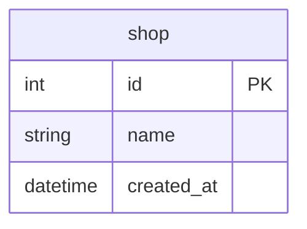

# Goで2相コミットにチャレンジ

## 概要

- Goで1相コミットと2相コミットを実装する方法を調査
- PostgreSQLとMySQLを対比させながら整理

## Docker

- データベースはPostgreSQLとMySQLのDockerコンテナを使用
- PostgreSQLとMySQLとも起動オプションでクエリーログを有効化
- PostgreSQLは `max_prepared_transactions` を 1 にして2相コミットを有効化
  - `max_prepared_transactions` は同時にプリペアド状態にできるトランザクションの最大数
  - MySQLはデフォルトで有効

### データベースのコンテナ起動

```shell
docker-compose up -d
```

もしくはDocker Composeのプラグイン版なら

```shell
docker compose up -d
```

### データベースのコンテナ削除

```shell
docker-compose down
```

もしくはDocker Composeのプラグイン版なら

```shell
docker compose down
```

### PostgreSQL

#### クエリーログの参照

標準エラー（stderr）に出力される

```shell
docker logs -f pgstmt
```

#### psqlによる接続

```shell
docker container exec -it pg2pc psql -U postgres
```

#### プリペアドトランザクションの確認

```shell
docker container exec -t pg2pc psql -U postgres -c 'SELECT * FROM pg_prepared_xacts'
```

### MySQL

#### クエリーログの参照

起動オプションでgeneral_log_fileに設定したファイルに出力される

```shell
docker container exec pg2pc tail -f /var/lib/mysql/query.log
```

#### MySQLモニタによる接続

```shell
docker container exec -it -e MYSQL_PWD=expasswd mysql2pc mysql xadb
```

#### PREPARED 状態にある XA トランザクションの確認

```shell
docker container exec -t -e MYSQL_PWD=expasswd mysql2pc mysql xadb -e 'XA RECOVER'
```

## テーブル

- 実行時のセットアップ処理で初期化
- 1テーブル（shop）のみ



## サンプルコードの実行

```shell
go run . サンプル名
```

- サンプル名は大文字小文字の区別なし

例

```shell
go run . ex04tx01
```

## 1相コミット

### BeginTx

- 標準ライブラリに用意されているBeginTxとCommitを使う
- PostgreSQLに1レコードINSERTして、MySQLから1レコードDELETEする。データベース間でデータを移動させるようなイメージ

https://github.com/ystkg/db-examples/blob/71ee2b2fcb12ecb81da92a7ff1b9e3f29a4fd427/ex04/ex04tx01.go#L10-L92

```shell
go run . ex04tx01
```

```json
{"time":"2024-09-18T17:50:17.343270258+09:00","level":"INFO","msg":"INSERT","RowsAffected":1}
{"time":"2024-09-18T17:50:17.344833172+09:00","level":"INFO","msg":"DELETE","RowsAffected":1}
```

```log
2024-09-18 17:50:17.340 JST [313] LOG:  statement: begin
2024-09-18 17:50:17.342 JST [313] LOG:  execute stmtcache_b5197bb703d4895f640c001d049e70c77cbe7dfe8baf65fb: INSERT INTO shop (name) VALUES ($1)
2024-09-18 17:50:17.342 JST [313] DETAIL:  parameters: $1 = 'shop1st'
2024-09-18 17:50:17.345 JST [313] LOG:  statement: commit
```

```log
2024-09-18T17:50:17.341408+09:00           11 Query     START TRANSACTION
2024-09-18T17:50:17.343853+09:00           11 Prepare   DELETE FROM shop WHERE NAME = ?
2024-09-18T17:50:17.344267+09:00           11 Execute   DELETE FROM shop WHERE NAME = 'shop1st'
2024-09-18T17:50:17.344895+09:00           11 Close stmt
2024-09-18T17:50:17.346577+09:00           11 Query     COMMIT
```

### ExecContext

https://github.com/ystkg/db-examples/blob/71ee2b2fcb12ecb81da92a7ff1b9e3f29a4fd427/ex04/ex04tx02.go#L32-L96

```shell
go run . ex04tx02
```

```json
{"time":"2024-09-18T17:53:36.844663051+09:00","level":"INFO","msg":"INSERT","RowsAffected":1}
{"time":"2024-09-18T17:53:36.846321949+09:00","level":"INFO","msg":"DELETE","RowsAffected":1}
```

```log
2024-09-18 17:53:36.837 JST [320] LOG:  statement: begin
2024-09-18 17:53:36.843 JST [320] LOG:  execute stmtcache_b5197bb703d4895f640c001d049e70c77cbe7dfe8baf65fb: INSERT INTO shop (name) VALUES ($1)
2024-09-18 17:53:36.843 JST [320] DETAIL:  parameters: $1 = 'shop2nd'
2024-09-18 17:53:36.846 JST [320] LOG:  statement: commit
```

```log
2024-09-18T17:53:36.838944+09:00           12 Query     START TRANSACTION
2024-09-18T17:53:36.845279+09:00           12 Prepare   DELETE FROM shop WHERE NAME = ?
2024-09-18T17:53:36.845693+09:00           12 Execute   DELETE FROM shop WHERE NAME = 'shop2nd'
2024-09-18T17:53:36.846426+09:00           12 Close stmt
2024-09-18T17:53:36.848369+09:00           12 Query     COMMIT
```

## 対話型

### PostgreSQL

#### 1相コミット

```shell
postgres=# begin;
BEGIN
postgres=*# INSERT INTO shop (name) VALUES ('shopclitx');
INSERT 0 1
postgres=*# commit;
COMMIT
```

#### 2相コミット

- begin
- prepare transaction
- commit prepared

```shell
postgres=# begin;
BEGIN
postgres=*# INSERT INTO shop (name) VALUES ('shopclixa');
INSERT 0 1
postgres=*# prepare transaction 'cli';
PREPARE TRANSACTION
postgres=# commit prepared 'cli';
COMMIT PREPARED
```

### MySQL

#### 1相コミット

```shell
mysql> START TRANSACTION;
Query OK, 0 rows affected (0.00 sec)

mysql> INSERT INTO shop (name) VALUES ('shopclitx');
Query OK, 1 row affected (0.00 sec)

mysql> COMMIT;
Query OK, 0 rows affected (0.00 sec)
```

#### 2相コミット

- XA BEGIN
- XA END
- XA PREPARE
- XA COMMIT

```shell
mysql> XA BEGIN 'cli';
Query OK, 0 rows affected (0.00 sec)

mysql> INSERT INTO shop (name) VALUES ('shopclixa');
Query OK, 1 row affected (0.00 sec)

mysql> XA END 'cli';
Query OK, 0 rows affected (0.00 sec)

mysql> XA PREPARE 'cli';
Query OK, 0 rows affected (0.01 sec)

mysql> XA COMMIT 'cli';
Query OK, 0 rows affected (0.01 sec)
```

## 2相コミット

### 一括

https://github.com/ystkg/db-examples/blob/71ee2b2fcb12ecb81da92a7ff1b9e3f29a4fd427/ex04/ex04xa01.go#L37-L149

```shell
go run . ex04xa01
```

```json
{"time":"2024-09-18T18:00:04.107632935+09:00","level":"INFO","msg":"INSERT","RowsAffected":1}
{"time":"2024-09-18T18:00:04.109266695+09:00","level":"INFO","msg":"DELETE","RowsAffected":1}
```

### 分離

https://github.com/ystkg/db-examples/blob/71ee2b2fcb12ecb81da92a7ff1b9e3f29a4fd427/ex04/ex04xa02.go#L38-L74

https://github.com/ystkg/db-examples/blob/71ee2b2fcb12ecb81da92a7ff1b9e3f29a4fd427/ex04/ex04xa02.go#L89-L139

```shell
go run . ex04xa02
```

```json
{"time":"2024-09-18T18:01:44.971069915+09:00","level":"INFO","msg":"INSERT","RowsAffected":1}
{"time":"2024-09-18T18:01:44.972711361+09:00","level":"INFO","msg":"prepare transaction"}
{"time":"2024-09-18T18:01:53.652926155+09:00","level":"INFO","msg":"DELETE","RowsAffected":1}
{"time":"2024-09-18T18:01:53.658452266+09:00","level":"INFO","msg":"XA PREPARE"}
```

#### PostgreSQL

```shell
postgres=# SELECT * FROM pg_prepared_xacts;
postgres=# commit prepared 'shop4th2pc';
```

#### MySQL

```shell
mysql> XA RECOVER;
mysql> XA COMMIT 'shop4th2pc';
```

## 各ステータス

### PostgreSQL

```shell
postgres=# TRUNCATE shop;
TRUNCATE TABLE
postgres=# begin;
BEGIN
postgres=*# INSERT INTO shop (name) VALUES ('shopclisec');
INSERT 0 1
postgres=*# SELECT * FROM shop;
 id |    name    |          created_at
----+------------+-------------------------------
  7 | shopclisec | 2024-09-18 18:08:36.951491+09
(1 row)

postgres=*# prepare transaction 'sec';
PREPARE TRANSACTION
postgres=# SELECT * FROM shop;
 id | name | created_at
----+------+------------
(0 rows)

postgres=# commit prepared 'sec';
COMMIT PREPARED
postgres=# SELECT * FROM shop;
 id |    name    |          created_at
----+------------+-------------------------------
  7 | shopclisec | 2024-09-18 18:08:36.951491+09
(1 row)
```

- `prepare transaction` をするとレコードが参照できなくなり、 `commit prepared` で再び参照できるようになる
- `prepare transaction` と `commit prepared` の間ではSELECTだけでなく、INSERTなど更新も実行することができるが、その更新内容がセキュア状態になっているトランザクションに含まれることはなく、別トランザクションの扱い

### MySQL

```shell
mysql> TRUNCATE shop;
Query OK, 0 rows affected (0.04 sec)

mysql> XA BEGIN 'sec';
Query OK, 0 rows affected (0.00 sec)

mysql> INSERT INTO shop (name) VALUES ('shopclisec');
Query OK, 1 row affected (0.00 sec)

mysql> SELECT * FROM shop;
+----+------------+---------------------+
| id | name       | created_at          |
+----+------------+---------------------+
|  1 | shopclisec | 2024-09-18 18:10:13 |
+----+------------+---------------------+
1 row in set (0.00 sec)

mysql> XA END 'sec';
Query OK, 0 rows affected (0.00 sec)

mysql> SELECT * FROM shop;
ERROR 1399 (XAE07): XAER_RMFAIL: The command cannot be executed when global transaction is in the  IDLE state
mysql> XA PREPARE 'sec';
Query OK, 0 rows affected (0.00 sec)

mysql> SELECT * FROM shop;
Empty set (0.00 sec)

mysql> XA COMMIT 'sec';
Query OK, 0 rows affected (0.00 sec)

mysql> SELECT * FROM shop;
+----+------------+---------------------+
| id | name       | created_at          |
+----+------------+---------------------+
|  1 | shopclisec | 2024-09-18 18:10:13 |
+----+------------+---------------------+
1 row in set (0.00 sec)
```

- `XA END` と `XA PREPARE` の間はIDLE状態なのでSELECTも実行できずエラーになる

## 関連ドキュメント

### PostgreSQL 17（英語）

- [PREPARE TRANSACTION](https://www.postgresql.org/docs/17/sql-prepare-transaction.html)
- [COMMIT PREPARED](https://www.postgresql.org/docs/17/sql-commit-prepared.html)
- [ROLLBACK PREPARED](https://www.postgresql.org/docs/17/sql-rollback-prepared.html)

### PostgreSQL 16（日本語）

- [PREPARE TRANSACTION](https://www.postgresql.jp/docs/16/sql-prepare-transaction.html)
- [COMMIT PREPARED](https://www.postgresql.jp/docs/16/sql-commit-prepared.html)
- [ROLLBACK PREPARED](https://www.postgresql.jp/docs/16/sql-rollback-prepared.html)

### MySQL 8.4（英語）

- [XA Transactions](https://dev.mysql.com/doc/refman/8.4/en/xa.html)
- [XA Transaction SQL Statements](https://dev.mysql.com/doc/refman/8.4/en/xa-statements.html)
- [XA Transaction States](https://dev.mysql.com/doc/refman/8.4/en/xa-states.html)

### MySQL 8.0（日本語）

- [XA トランザクション](https://dev.mysql.com/doc/refman/8.0/ja/xa.html)
- [XA トランザクション SQL ステートメント](https://dev.mysql.com/doc/refman/8.0/ja/xa-statements.html)
- [XA トランザクションの状態](https://dev.mysql.com/doc/refman/8.0/ja/xa-states.html)
